# Diagram Konteks - Legian Medical Clinic Website

## Overview
Diagram konteks menunjukkan sistem utama dan entitas eksternal yang berinteraksi dengan website Legian Medical Clinic.

## Diagram Konteks (DFD Level 0)

```mermaid
graph TB
    CMS(("Sistem Website<br/>Legian Medical Clinic"))
    
    Visitor["Pengunjung Website"]
    Admin["Admin User"]
    EmailServer["Email Server"]
    Database[("Database")]
    Storage[("File Storage")]
    
    %% Visitor to System
    Visitor -->|"data bahasa"| CMS
    Visitor -->|"data kuesioner"| CMS
    
    %% System to Visitor
    CMS -->|"info dokter"| Visitor
    CMS -->|"info layanan"| Visitor
    CMS -->|"info FAQ"| Visitor
    CMS -->|"info konten halaman"| Visitor
    
    %% Admin to System
    Admin -->|"data login admin"| CMS
    Admin -->|"data dokter"| CMS
    Admin -->|"data layanan"| CMS
    Admin -->|"data konten halaman"| CMS
    Admin -->|"data FAQ"| CMS
    Admin -->|"data reset password"| CMS
    Admin -->|"data register admin"| CMS
    
    %% System to Admin
    CMS -->|"info login"| Admin
    CMS -->|"info dashboard"| Admin
    CMS -->|"info dokter"| Admin
    CMS -->|"info layanan"| Admin
    CMS -->|"info konten"| Admin
    CMS -->|"info FAQ"| Admin
    CMS -->|"info activity log"| Admin
    
    %% Email Server
    CMS -->|"data email reset password"| EmailServer
    EmailServer -->|"email reset password"| Admin
    
    %% Database
    CMS -->|"query data"| Database
    Database -->|"data dokter"| CMS
    Database -->|"data layanan"| CMS
    Database -->|"data konten halaman"| CMS
    Database -->|"data FAQ"| CMS
    Database -->|"data admin user"| CMS
    Database -->|"data activity log"| CMS
    
    %% Storage
    CMS -->|"query file"| Storage
    Storage -->|"file foto dokter"| CMS
    Storage -->|"file icon layanan"| CMS
    Storage -->|"file hero slider"| CMS
    
    style CMS fill:#E8F4F8,stroke:#2E5C8A,stroke-width:3px,color:#000
    style Visitor fill:#fff,stroke:#2E7D4E,stroke-width:2px,color:#000
    style Admin fill:#fff,stroke:#C92A2A,stroke-width:2px,color:#000
    style EmailServer fill:#fff,stroke:#D97706,stroke-width:2px,color:#000
    style Database fill:#fff,stroke:#6B3483,stroke-width:2px,color:#000
    style Storage fill:#fff,stroke:#117A65,stroke-width:2px,color:#000
```

## Deskripsi Entitas Eksternal

### 1. Pengunjung Website
Mengakses website untuk melihat informasi klinik, dokter, layanan, dan FAQ.

### 2. Admin User
Mengelola konten website melalui admin panel (doctors, services, FAQ, content pages).

### 3. Email Server
Mengirim email reset password kepada admin user.

### 4. Database
Menyimpan semua data aplikasi (admin users, doctors, services, content, FAQ, activity logs).

### 5. File Storage
Menyimpan file gambar dan media (foto dokter, icon layanan, hero slider).

---

**Dibuat**: 2024  
**Versi**: 1.0  
**Sistem**: Legian Medical Clinic Website CMS

