# Diagram Konteks Sistem - Legian Medical Clinic (Graphviz DOT)

## Deskripsi
Diagram konteks (Context Diagram / DFD Level 0) menggambarkan sistem secara keseluruhan dan interaksinya dengan entitas eksternal.

**Format:** Diagram ini menggunakan Graphviz DOT format yang dapat dirender menggunakan:
- Online: https://dreampuf.github.io/GraphvizOnline/ atau http://www.webgraphviz.com/
- Command line: `dot -Tsvg context-diagram.dot -o context-diagram.svg`
- VS Code: Extension "Graphviz Preview"
- Online tools lainnya yang mendukung DOT format

## Diagram Konteks (Graphviz DOT)

```dot
digraph ContextDiagram {
    rankdir=TB;
    node [shape=box, style=filled];
    
    // Sistem Utama
    System [label="Sistem Website\nLegian Medical Clinic", 
            shape=box3d, 
            fillcolor="#e1f5ff", 
            style="filled,rounded",
            color="#01579b",
            penwidth=3];
    
    // Entitas Eksternal
    SuperAdmin [label="Super Admin", 
                fillcolor="#ffebee", 
                color="#c62828",
                penwidth=2];
    
    Admin [label="Admin", 
           fillcolor="#fff3e0", 
           color="#e65100",
           penwidth=2];
    
    Visitor [label="Pengunjung Website", 
             fillcolor="#f3e5f5", 
             color="#4a148c",
             penwidth=2];
    
    GoogleAPI [label="Google Translate API", 
               shape=ellipse,
               fillcolor="#e8f5e9", 
               color="#1b5e20",
               penwidth=2];
    
    // Super Admin Input Flows
    SuperAdmin -> System [label="data login super admin"];
    SuperAdmin -> System [label="data dokter"];
    SuperAdmin -> System [label="data layanan"];
    SuperAdmin -> System [label="data FAQ"];
    SuperAdmin -> System [label="data konten halaman"];
    SuperAdmin -> System [label="data hero slide"];
    SuperAdmin -> System [label="data user admin"];
    SuperAdmin -> System [label="data pengaturan akun"];
    
    // Super Admin Output Flows
    System -> SuperAdmin [label="info login"];
    System -> SuperAdmin [label="info dokter"];
    System -> SuperAdmin [label="info layanan"];
    System -> SuperAdmin [label="info FAQ"];
    System -> SuperAdmin [label="info konten halaman"];
    System -> SuperAdmin [label="info hero slide"];
    System -> SuperAdmin [label="info user admin"];
    System -> SuperAdmin [label="info dashboard"];
    System -> SuperAdmin [label="info log aktivitas"];
    
    // Admin Input Flows
    Admin -> System [label="data login admin"];
    Admin -> System [label="data dokter"];
    Admin -> System [label="data layanan"];
    Admin -> System [label="data FAQ"];
    Admin -> System [label="data konten halaman"];
    Admin -> System [label="data hero slide"];
    Admin -> System [label="data pengaturan akun"];
    
    // Admin Output Flows
    System -> Admin [label="info login"];
    System -> Admin [label="info dokter"];
    System -> Admin [label="info layanan"];
    System -> Admin [label="info FAQ"];
    System -> Admin [label="info konten halaman"];
    System -> Admin [label="info hero slide"];
    System -> Admin [label="info dashboard"];
    System -> Admin [label="info log aktivitas"];
    
    // Visitor Input Flows
    Visitor -> System [label="data request halaman"];
    Visitor -> System [label="data pilihan bahasa"];
    Visitor -> System [label="data response kuesioner"];
    
    // Visitor Output Flows
    System -> Visitor [label="info konten website"];
    System -> Visitor [label="info dokter"];
    System -> Visitor [label="info layanan"];
    System -> Visitor [label="info FAQ"];
    System -> Visitor [label="info konten halaman"];
    System -> Visitor [label="info hero slide"];
    System -> Visitor [label="info layout prioritas"];
    
    // Google API Flows
    System -> GoogleAPI [label="data teks bahasa Indonesia"];
    GoogleAPI -> System [label="info teks terjemahan"];
}
```



## File DOT Terpisah

Untuk penggunaan lebih mudah, simpan kode di atas sebagai file `context-diagram.dot` dan render menggunakan:

### Menggunakan Command Line (Graphviz):
```bash
# Install Graphviz terlebih dahulu
# Windows: choco install graphviz
# Linux: sudo apt-get install graphviz
# Mac: brew install graphviz

# Render ke SVG
dot -Tsvg context-diagram.dot -o context-diagram.svg

# Render ke PNG
dot -Tpng context-diagram.dot -o context-diagram.png

# Render ke PDF
dot -Tpdf context-diagram.dot -o context-diagram.pdf
```

### Menggunakan Online Tools:
1. **GraphvizOnline**: https://dreampuf.github.io/GraphvizOnline/
   - Paste kode DOT
   - Download hasil sebagai SVG/PNG
2. **WebGraphviz**: http://www.webgraphviz.com/
   - Paste kode DOT
   - Klik "Generate Graph!"
3. **Edotor**: https://edotor.net/
   - Editor online dengan live preview

### Menggunakan VS Code:
1. Install extension "Graphviz Preview"
2. Buka file `.dot`
3. Klik kanan dan pilih "Open Preview"

## Entitas Eksternal

### 1. Super Admin
**Deskripsi:** Pengguna dengan akses penuh ke admin panel, termasuk manajemen user admin.

**Aktivitas:**
- Login ke admin panel
- Mengelola data dokter (CRUD)
- Mengelola layanan medis (CRUD)
- Mengelola FAQ (CRUD)
- Mengelola halaman konten (Tentang Kami, Kontak, dll)
- Mengelola hero slides (CRUD)
- Mengelola user admin (CRUD) - **hanya Super Admin**
- Mengatur akun sendiri (ubah username/password)
- Melihat dashboard dan log aktivitas

**Alur Data:**
- Input: Kredensial login, data CRUD (dokter, layanan, FAQ, konten, hero slide, user admin)
- Output: Dashboard, konfirmasi operasi, data yang dikelola, info user admin

### 2. Admin
**Deskripsi:** Pengguna dengan akses terbatas ke admin panel, tidak dapat mengelola user admin.

**Aktivitas:**
- Login ke admin panel
- Mengelola data dokter (CRUD)
- Mengelola layanan medis (CRUD)
- Mengelola FAQ (CRUD)
- Mengelola halaman konten (Tentang Kami, Kontak, dll)
- Mengelola hero slides (CRUD)
- Mengatur akun sendiri (ubah username/password)
- Melihat dashboard dan log aktivitas

**Alur Data:**
- Input: Kredensial login, data CRUD (dokter, layanan, FAQ, konten, hero slide)
- Output: Dashboard, konfirmasi operasi, data yang dikelola

### 3. Pengunjung Website (Public Visitor)
**Deskripsi:** Pengunjung yang mengakses website publik untuk melihat informasi klinik.

**Aktivitas:**
- Melihat halaman utama website
- Melihat informasi dokter
- Melihat layanan medis
- Melihat FAQ
- Melihat konten halaman (Tentang Kami, Kontak)
- Melihat hero slides
- Mengganti bahasa (Indonesia/Inggris)
- Mengisi kuesioner preferensi section

**Alur Data:**
- Input: Request halaman, pilihan bahasa, response kuesioner
- Output: Konten website yang dilokalisasi sesuai bahasa

### 4. Google Translate API (Layanan Eksternal)
**Deskripsi:** Layanan eksternal untuk auto-translation dari bahasa Indonesia ke bahasa Inggris.

**Aktivitas:**
- Menerima request terjemahan
- Mengembalikan teks yang sudah diterjemahkan

**Alur Data:**
- Input: Teks bahasa Indonesia
- Output: Teks bahasa Inggris

## Sistem Utama

### Sistem Website Legian Medical Clinic
**Deskripsi:** Sistem website untuk klinik medis yang terdiri dari:
- Website publik (frontend) untuk menampilkan informasi
- Admin panel (backend) untuk mengelola konten
- Layanan auto-translation untuk dukungan multi-bahasa

**Fitur Utama:**
1. **Website Publik:**
   - Menampilkan informasi dokter, layanan, FAQ, konten halaman, dan hero slides
   - Dukungan multi-bahasa (Indonesia/Inggris)
   - Prioritisasi konten dinamis berdasarkan kuesioner

2. **Admin Panel:**
   - Autentikasi & Otorisasi (Admin/Super Admin)
   - Operasi CRUD untuk semua konten
   - Manajemen user (hanya Super Admin)
   - Pengaturan akun
   - Pencatatan aktivitas

3. **Auto-Translation:**
   - Otomatis menerjemahkan konten dari bahasa Indonesia ke bahasa Inggris
   - Menggunakan Google Translate API

## Penyimpanan Data (Internal)

Sistem menggunakan database untuk menyimpan:
- `admin_users` - Data admin user
- `doctors` - Data dokter
- `services` - Data layanan medis
- `faqs` - Data FAQ
- `content_pages` - Konten halaman (Tentang Kami, Kontak, dll)
- `hero_slides` - Data hero slides untuk homepage
- `activity_logs` - Log aktivitas admin
- `sessions` - Data session

## Catatan Penting

1. **Autentikasi:** Admin harus login terlebih dahulu sebelum mengakses admin panel
2. **Otorisasi:** Super Admin memiliki akses penuh, Admin memiliki akses terbatas
3. **Auto-Translation:** Hanya admin yang input bahasa Indonesia, sistem otomatis translate ke bahasa Inggris
4. **Lokalisasi:** Website publik menampilkan konten sesuai bahasa yang dipilih pengunjung
5. **Pencatatan Aktivitas:** Semua aktivitas admin dicatat untuk audit trail

---

**Versi:** 1.0  
**Tanggal:** 2025-01-14  
**Format:** Graphviz DOT  
**Status:** Current

