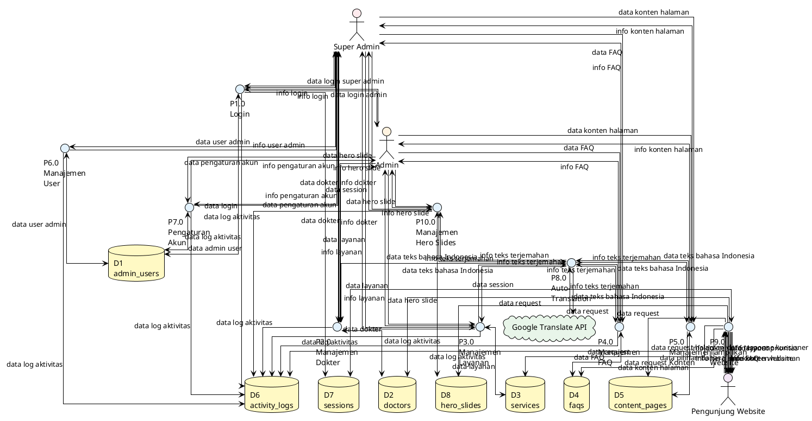

# DFD Level 0 - Sistem Website Legian Medical Clinic

## Deskripsi
DFD Level 0 (Data Flow Diagram Level 0) menggambarkan proses-proses utama dalam sistem dan alur data antara proses, entitas eksternal, dan data store.

**Catatan Simbol:**
- **Proses:** Lingkaran dengan label P1.0, P2.0, dst.
- **Data Store:** Dua garis horizontal paralel (open-ended rectangle) dengan label D1, D2, dst. - direpresentasikan sebagai persegi panjang dengan border tebal di bagian atas dan bawah.
- **Entitas Eksternal:** Kotak dengan label nama entitas.

## DFD Level 0

## Proses-Proses Utama

### P1.0 Login
**Deskripsi:** Proses autentikasi untuk Super Admin dan Admin.

**Input:**
- `data login super admin` dari Super Admin
- `data login admin` dari Admin

**Output:**
- `info login` ke Super Admin/Admin
- `data session` ke D7 (sessions)
- `data log aktivitas` ke D6 (activity_logs)

**Data Store:**
- D1 (admin_users) - membaca dan menulis data login

---

### P2.0 Manajemen Dokter
**Deskripsi:** Proses CRUD untuk mengelola data dokter.

**Input:**
- `data dokter` dari Super Admin/Admin
- `info teks terjemahan` dari P8.0 (Auto-Translation)

**Output:**
- `info dokter` ke Super Admin/Admin
- `data log aktivitas` ke D6 (activity_logs)
- `data teks bahasa Indonesia` ke P8.0 (untuk auto-translation)

**Data Store:**
- D2 (doctors) - membaca dan menulis data dokter

---

### P3.0 Manajemen Layanan
**Deskripsi:** Proses CRUD untuk mengelola data layanan medis.

**Input:**
- `data layanan` dari Super Admin/Admin
- `info teks terjemahan` dari P8.0 (Auto-Translation)

**Output:**
- `info layanan` ke Super Admin/Admin
- `data log aktivitas` ke D6 (activity_logs)
- `data teks bahasa Indonesia` ke P8.0 (untuk auto-translation)

**Data Store:**
- D3 (services) - membaca dan menulis data layanan

---

### P4.0 Manajemen FAQ
**Deskripsi:** Proses CRUD untuk mengelola data FAQ.

**Input:**
- `data FAQ` dari Super Admin/Admin
- `info teks terjemahan` dari P8.0 (Auto-Translation)

**Output:**
- `info FAQ` ke Super Admin/Admin
- `data log aktivitas` ke D6 (activity_logs)
- `data teks bahasa Indonesia` ke P8.0 (untuk auto-translation)

**Data Store:**
- D4 (faqs) - membaca dan menulis data FAQ

---

### P5.0 Manajemen Konten
**Deskripsi:** Proses CRUD untuk mengelola konten halaman (Tentang Kami, Kontak, dll).

**Input:**
- `data konten halaman` dari Super Admin/Admin
- `info teks terjemahan` dari P8.0 (Auto-Translation)

**Output:**
- `info konten halaman` ke Super Admin/Admin
- `data log aktivitas` ke D6 (activity_logs)
- `data teks bahasa Indonesia` ke P8.0 (untuk auto-translation)

**Data Store:**
- D5 (content_pages) - membaca dan menulis data konten

---

### P6.0 Manajemen User
**Deskripsi:** Proses CRUD untuk mengelola user admin (hanya Super Admin).

**Input:**
- `data user admin` dari Super Admin

**Output:**
- `info user admin` ke Super Admin
- `data log aktivitas` ke D6 (activity_logs)

**Data Store:**
- D1 (admin_users) - membaca dan menulis data user admin

---

### P7.0 Pengaturan Akun
**Deskripsi:** Proses untuk mengubah username dan password akun yang sedang login.

**Input:**
- `data pengaturan akun` dari Super Admin/Admin

**Output:**
- `info pengaturan akun` ke Super Admin/Admin
- `data log aktivitas` ke D6 (activity_logs)

**Data Store:**
- D1 (admin_users) - membaca dan menulis data admin user

---

### P8.0 Auto-Translation
**Deskripsi:** Proses untuk menerjemahkan teks bahasa Indonesia ke bahasa Inggris secara otomatis.

**Input:**
- `data teks bahasa Indonesia` dari P2.0, P3.0, P4.0, P5.0
- `info teks terjemahan` dari Google Translate API

**Output:**
- `info teks terjemahan` ke P2.0, P3.0, P4.0, P5.0
- `data teks bahasa Indonesia` ke Google Translate API

**External Entity:**
- Google Translate API

---

### P9.0 Tampilkan Website
**Deskripsi:** Proses untuk menampilkan konten website kepada pengunjung.

**Input:**
- `data request halaman` dari Pengunjung Website
- `data pilihan bahasa` dari Pengunjung Website
- `data response kuesioner` dari Pengunjung Website

**Output:**
- `info konten website` ke Pengunjung Website
- `info dokter` ke Pengunjung Website
- `info layanan` ke Pengunjung Website
- `info FAQ` ke Pengunjung Website
- `info konten halaman` ke Pengunjung Website
- `info hero slide` ke Pengunjung Website
- `info layout prioritas` ke Pengunjung Website

**Data Store:**
- D2 (doctors) - membaca data dokter
- D3 (services) - membaca data layanan
- D4 (faqs) - membaca data FAQ
- D5 (content_pages) - membaca data konten
- D8 (hero_slides) - membaca data hero slides
- D7 (sessions) - membaca dan menulis data session

---

### P10.0 Manajemen Hero Slides
**Deskripsi:** Proses CRUD untuk mengelola data hero slides.

**Input:**
- `data hero slide` dari Super Admin/Admin
- `info teks terjemahan` dari P8.0 (Auto-Translation)

**Output:**
- `info hero slide` ke Super Admin/Admin
- `data log aktivitas` ke D6 (activity_logs)
- `data teks bahasa Indonesia` ke P8.0 (untuk auto-translation)

**Data Store:**
- D8 (hero_slides) - membaca dan menulis data hero slides

---

## Data Store

### D1. admin_users
**Deskripsi:** Menyimpan data admin user (Super Admin dan Admin).

**Digunakan oleh:**
- P1.0 (Login) - membaca dan menulis
- P6.0 (Manajemen User) - membaca dan menulis
- P7.0 (Pengaturan Akun) - membaca dan menulis

---

### D2. doctors
**Deskripsi:** Menyimpan data dokter.

**Digunakan oleh:**
- P2.0 (Manajemen Dokter) - membaca dan menulis
- P9.0 (Tampilkan Website) - membaca

---

### D3. services
**Deskripsi:** Menyimpan data layanan medis.

**Digunakan oleh:**
- P3.0 (Manajemen Layanan) - membaca dan menulis
- P9.0 (Tampilkan Website) - membaca

---

### D4. faqs
**Deskripsi:** Menyimpan data FAQ.

**Digunakan oleh:**
- P4.0 (Manajemen FAQ) - membaca dan menulis
- P9.0 (Tampilkan Website) - membaca

---

### D5. content_pages
**Deskripsi:** Menyimpan konten halaman (Tentang Kami, Kontak, dll).

**Digunakan oleh:**
- P5.0 (Manajemen Konten) - membaca dan menulis
- P9.0 (Tampilkan Website) - membaca

---

### D6. activity_logs
**Deskripsi:** Menyimpan log aktivitas admin.

**Digunakan oleh:**
- P1.0 (Login) - menulis
- P2.0 (Manajemen Dokter) - menulis
- P3.0 (Manajemen Layanan) - menulis
- P4.0 (Manajemen FAQ) - menulis
- P5.0 (Manajemen Konten) - menulis
- P6.0 (Manajemen User) - menulis
- P7.0 (Pengaturan Akun) - menulis

---

### D7. sessions
**Deskripsi:** Menyimpan data session untuk autentikasi dan lokalisasi bahasa.

**Digunakan oleh:**
- P1.0 (Login) - menulis
- P9.0 (Tampilkan Website) - membaca dan menulis

---

### D8. hero_slides
**Deskripsi:** Menyimpan data hero slides untuk homepage.

**Digunakan oleh:**
- P10.0 (Manajemen Hero Slides) - membaca dan menulis
- P9.0 (Tampilkan Website) - membaca

---

## Catatan Penting

1. **P6.0 Manajemen User** hanya dapat diakses oleh Super Admin
2. **P8.0 Auto-Translation** bekerja secara otomatis saat admin menyimpan data dalam bahasa Indonesia
3. **P9.0 Tampilkan Website** membaca data dari multiple data stores untuk menampilkan konten yang dilokalisasi
4. Semua proses manajemen (P2-P5, P10) mencatat aktivitas ke D6 (activity_logs)
5. P2, P3, P4, P5, P10 mengirim data ke P8 untuk auto-translation sebelum menyimpan ke database

---

**Versi:** 1.0  
**Tanggal:** 2025-01-14  
**Status:** Current

