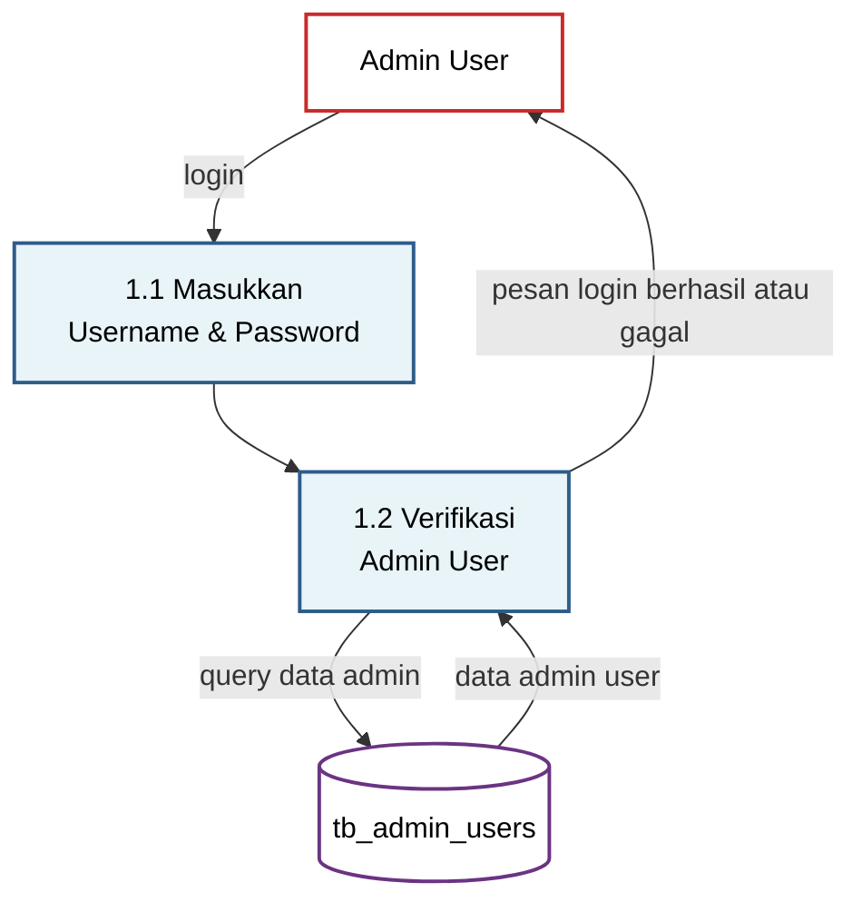
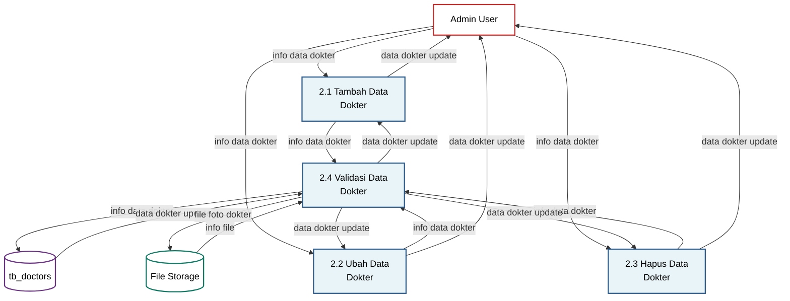
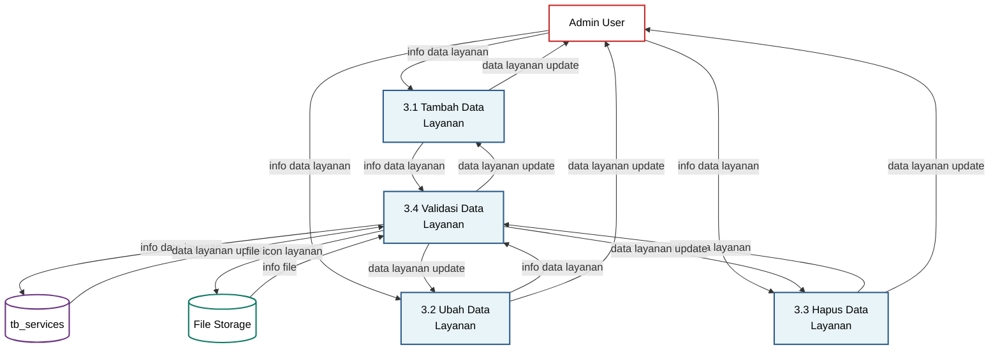
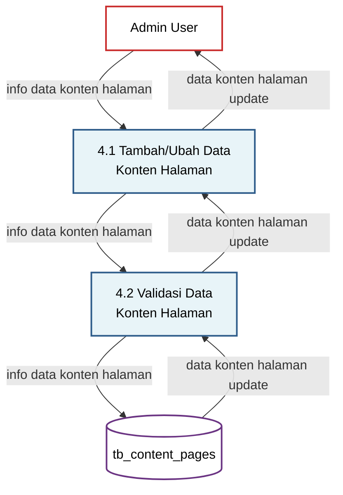
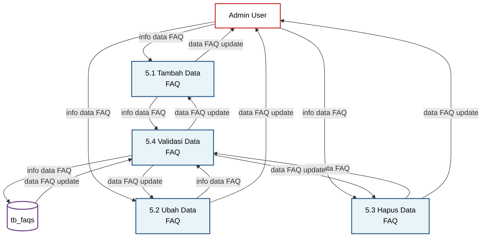
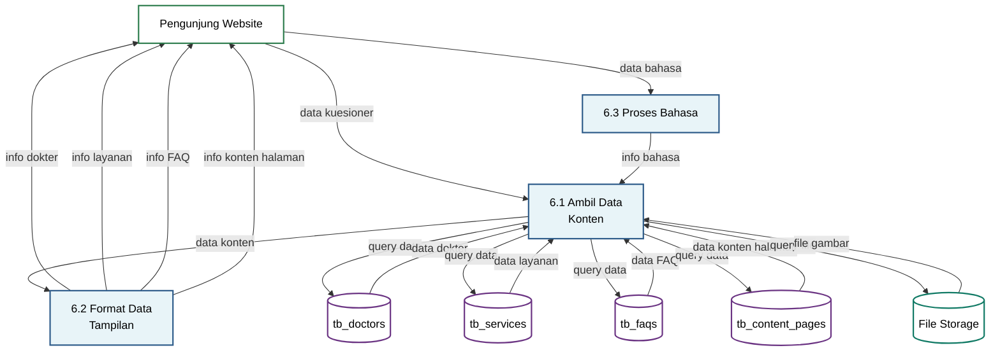

# DFD Level 1 - Legian Medical Clinic Website

## Overview
DFD Level 1 memecah sistem menjadi proses-proses detail yang menunjukkan alur data internal sistem.

---

## 1. DFD Level 1 - Login/Register Admin (P1.0)

**Keterangan:**
- **1.1 Masukkan Username & Password**: Proses menerima input username dan password dari admin
- **1.2 Verifikasi Admin User**: Proses memverifikasi kredensial dengan database dan mengembalikan pesan sukses/gagal

---

## 2. DFD Level 1 - Manajemen Dokter (P2.0)

**Keterangan:**
- **2.1 Tambah Data Dokter**: Proses menambah data dokter baru
- **2.2 Ubah Data Dokter**: Proses mengubah data dokter yang sudah ada
- **2.3 Hapus Data Dokter**: Proses menghapus data dokter
- **2.4 Validasi Data Dokter**: Proses memvalidasi data sebelum disimpan ke database dan storage

---

## 3. DFD Level 1 - Manajemen Layanan (P3.0)

**Keterangan:**
- **3.1 Tambah Data Layanan**: Proses menambah data layanan medis baru
- **3.2 Ubah Data Layanan**: Proses mengubah data layanan yang sudah ada
- **3.3 Hapus Data Layanan**: Proses menghapus data layanan
- **3.4 Validasi Data Layanan**: Proses memvalidasi data sebelum disimpan ke database dan storage

---

## 4. DFD Level 1 - Manajemen Konten Halaman (P4.0)

**Keterangan:**
- **4.1 Tambah/Ubah Data Konten Halaman**: Proses menambah atau mengubah konten halaman (About Us, Contact, FAQ)
- **4.2 Validasi Data Konten Halaman**: Proses memvalidasi data konten sebelum disimpan ke database

---

## 5. DFD Level 1 - Manajemen FAQ (P5.0)

**Keterangan:**
- **5.1 Tambah Data FAQ**: Proses menambah FAQ baru
- **5.2 Ubah Data FAQ**: Proses mengubah FAQ yang sudah ada
- **5.3 Hapus Data FAQ**: Proses menghapus FAQ (soft delete)
- **5.4 Validasi Data FAQ**: Proses memvalidasi data FAQ sebelum disimpan ke database

---

## 6. DFD Level 1 - Manajemen Tampilan Website (P6.0)

**Keterangan:**
- **6.1 Ambil Data Konten**: Proses mengambil data dari database dan storage
- **6.2 Format Data Tampilan**: Proses memformat data untuk ditampilkan ke pengunjung
- **6.3 Proses Bahasa**: Proses menangani switching bahasa (ID/EN)

---

## Deskripsi Proses

### Manajemen Dokter (P2.0)
Sistem memungkinkan admin untuk menambah, mengubah, dan menghapus data dokter. Semua operasi melalui proses validasi sebelum disimpan ke database. Foto dokter disimpan di file storage.

### Manajemen Layanan (P3.0)
Sistem memungkinkan admin untuk menambah, mengubah, dan menghapus data layanan medis. Icon layanan disimpan di file storage.

### Manajemen Konten Halaman (P4.0)
Sistem memungkinkan admin untuk mengelola konten halaman About Us, Contact, dan FAQ. Konten mendukung multi-language (ID/EN).

### Manajemen FAQ (P5.0)
Sistem memungkinkan admin untuk menambah, mengubah, dan menghapus FAQ. Sistem menggunakan soft delete untuk menjaga data history.

### Manajemen Tampilan Website (P6.0)
Sistem menampilkan konten kepada pengunjung website dengan dukungan multi-language dan dynamic content prioritization berdasarkan kuesioner.

---

**Dibuat**: 2024  
**Versi**: 1.0  
**Sistem**: Legian Medical Clinic Website CMS

