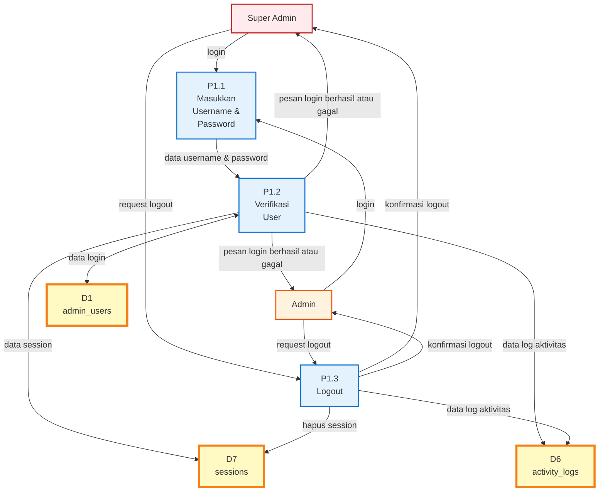
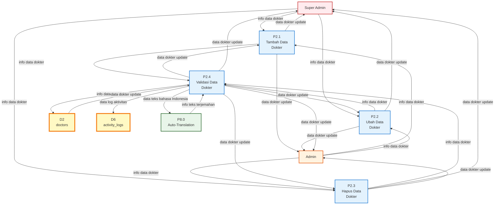
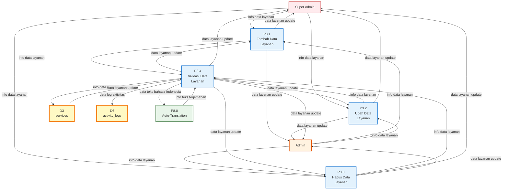
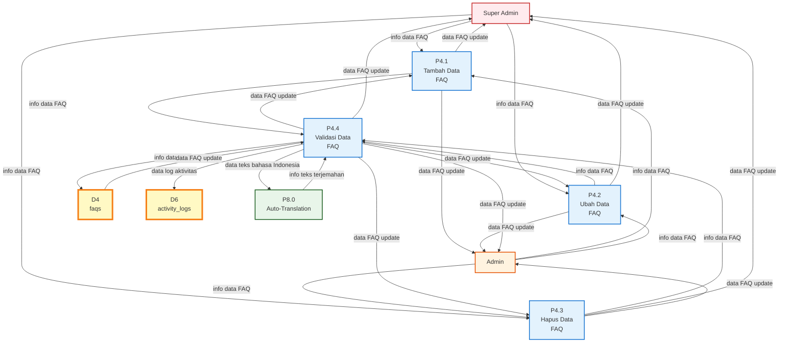
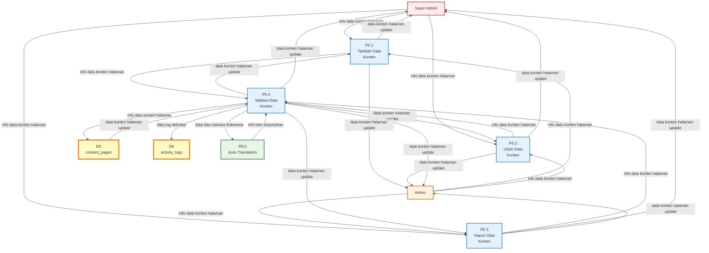
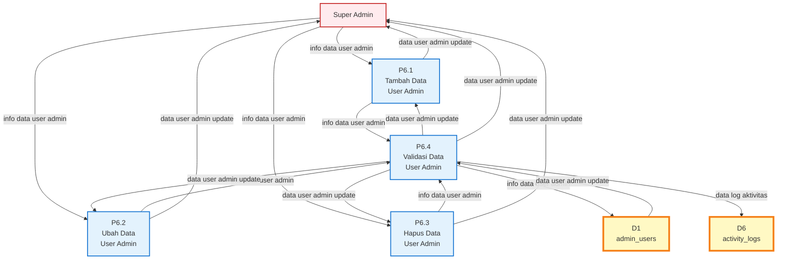
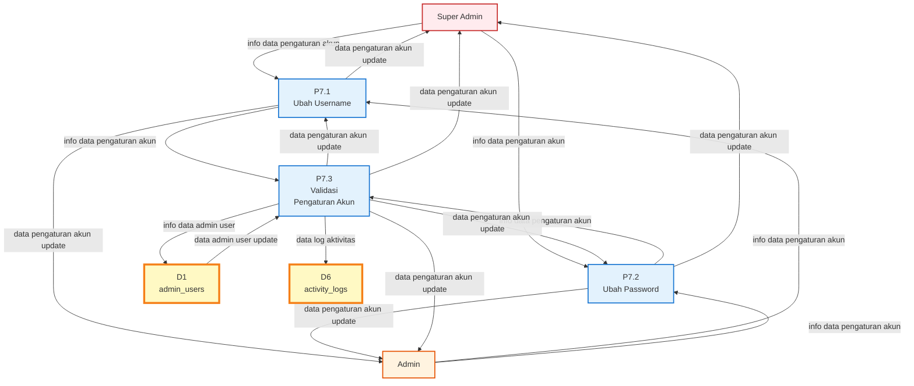
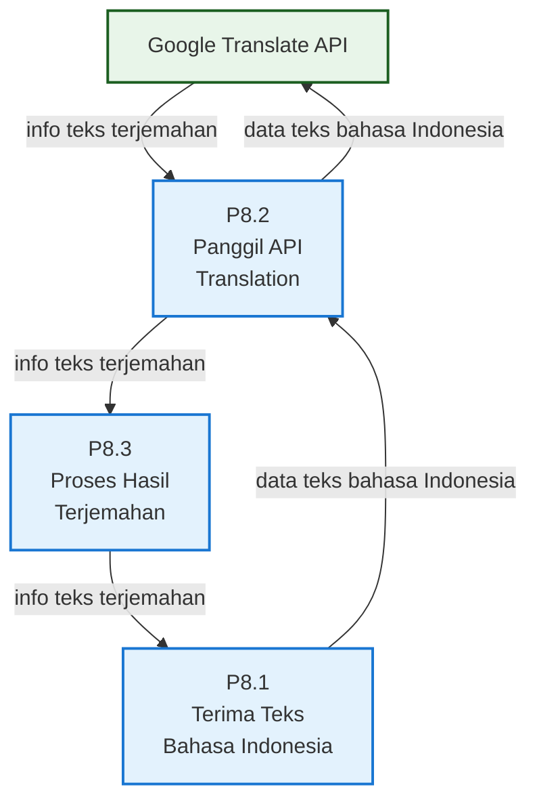
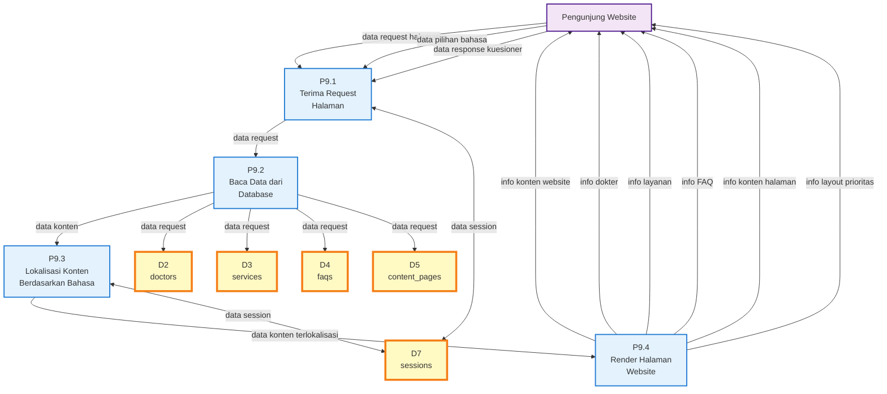

# DFD Level 1 - Sistem Website Legian Medical Clinic

## Deskripsi
DFD Level 1 (Data Flow Diagram Level 1) adalah dekomposisi dari setiap proses di DFD Level 0 menjadi sub-proses yang lebih detail. Setiap proses utama (P1.0, P2.0, dst.) dipecah menjadi proses-proses spesifik yang menggambarkan langkah-langkah detail dalam sistem.

**Catatan Simbol:**
- **Proses:** Lingkaran dengan label P1.1, P1.2, P2.1, dst. (sub-proses dari proses utama)
- **Data Store:** Dua garis horizontal paralel dengan label D1, D2, dst.
- **Entitas Eksternal:** Kotak dengan label nama entitas.

## DFD Level 1

### P1.0 Login

---

### P2.0 Manajemen Dokter

---

### P3.0 Manajemen Layanan

---

### P4.0 Manajemen FAQ

---

### P5.0 Manajemen Konten

---

### P6.0 Manajemen User

---

### P7.0 Pengaturan Akun

---

### P8.0 Auto-Translation

---

### P9.0 Tampilkan Website

---

## Deskripsi Sub-Proses

### P1.0 Login

#### P1.1 Masukkan Username & Password
**Deskripsi:** Proses untuk menerima input username dan password dari Super Admin atau Admin.

**Input:**
- `login` dari Super Admin/Admin

**Output:**
- `data username & password` ke P1.2

---

#### P1.2 Verifikasi User
**Deskripsi:** Proses untuk memverifikasi kredensial user dengan data di database.

**Input:**
- `data username & password` dari P1.1
- `data login` dari D1 (admin_users)

**Output:**
- `pesan login berhasil atau gagal` ke Super Admin/Admin
- `data session` ke D7 (sessions)
- `data log aktivitas` ke D6 (activity_logs)

**Data Store:**
- D1 (admin_users) - membaca data login
- D7 (sessions) - menulis data session
- D6 (activity_logs) - menulis log aktivitas

---

### P2.0 Manajemen Dokter

#### P2.1 Tambah Data Dokter
**Deskripsi:** Proses untuk menambahkan data dokter baru.

**Input:**
- `info data dokter` dari Super Admin/Admin
- `data dokter update` dari P2.4

**Output:**
- `data dokter update` ke Super Admin/Admin
- `info data dokter` ke P2.4

---

#### P2.2 Ubah Data Dokter
**Deskripsi:** Proses untuk mengubah data dokter yang sudah ada.

**Input:**
- `info data dokter` dari Super Admin/Admin
- `data dokter update` dari P2.4

**Output:**
- `data dokter update` ke Super Admin/Admin
- `info data dokter` ke P2.4

---

#### P2.3 Hapus Data Dokter
**Deskripsi:** Proses untuk menghapus data dokter.

**Input:**
- `info data dokter` dari Super Admin/Admin
- `data dokter update` dari P2.4

**Output:**
- `data dokter update` ke Super Admin/Admin
- `info data dokter` ke P2.4

---

#### P2.4 Validasi Data Dokter
**Deskripsi:** Proses untuk memvalidasi data dokter sebelum disimpan ke database, termasuk auto-translation.

**Input:**
- `info data dokter` dari P2.1, P2.2, P2.3
- `data dokter update` dari D2 (doctors)
- `info teks terjemahan` dari P8.0

**Output:**
- `data dokter update` ke P2.1, P2.2, P2.3, Super Admin/Admin
- `info data dokter` ke D2 (doctors)
- `data log aktivitas` ke D6 (activity_logs)
- `data teks bahasa Indonesia` ke P8.0

**Data Store:**
- D2 (doctors) - membaca dan menulis data dokter
- D6 (activity_logs) - menulis log aktivitas

---

### P3.0 Manajemen Layanan

#### P3.1 Tambah Data Layanan
**Deskripsi:** Proses untuk menambahkan data layanan baru.

**Input:**
- `info data layanan` dari Super Admin/Admin
- `data layanan update` dari P3.4

**Output:**
- `data layanan update` ke Super Admin/Admin
- `info data layanan` ke P3.4

---

#### P3.2 Ubah Data Layanan
**Deskripsi:** Proses untuk mengubah data layanan yang sudah ada.

**Input:**
- `info data layanan` dari Super Admin/Admin
- `data layanan update` dari P3.4

**Output:**
- `data layanan update` ke Super Admin/Admin
- `info data layanan` ke P3.4

---

#### P3.3 Hapus Data Layanan
**Deskripsi:** Proses untuk menghapus data layanan.

**Input:**
- `info data layanan` dari Super Admin/Admin
- `data layanan update` dari P3.4

**Output:**
- `data layanan update` ke Super Admin/Admin
- `info data layanan` ke P3.4

---

#### P3.4 Validasi Data Layanan
**Deskripsi:** Proses untuk memvalidasi data layanan sebelum disimpan ke database, termasuk auto-translation.

**Input:**
- `info data layanan` dari P3.1, P3.2, P3.3
- `data layanan update` dari D3 (services)
- `info teks terjemahan` dari P8.0

**Output:**
- `data layanan update` ke P3.1, P3.2, P3.3, Super Admin/Admin
- `info data layanan` ke D3 (services)
- `data log aktivitas` ke D6 (activity_logs)
- `data teks bahasa Indonesia` ke P8.0

**Data Store:**
- D3 (services) - membaca dan menulis data layanan
- D6 (activity_logs) - menulis log aktivitas

---

### P4.0 Manajemen FAQ

#### P4.1 Tambah Data FAQ
**Deskripsi:** Proses untuk menambahkan data FAQ baru.

**Input:**
- `info data FAQ` dari Super Admin/Admin
- `data FAQ update` dari P4.4

**Output:**
- `data FAQ update` ke Super Admin/Admin
- `info data FAQ` ke P4.4

---

#### P4.2 Ubah Data FAQ
**Deskripsi:** Proses untuk mengubah data FAQ yang sudah ada.

**Input:**
- `info data FAQ` dari Super Admin/Admin
- `data FAQ update` dari P4.4

**Output:**
- `data FAQ update` ke Super Admin/Admin
- `info data FAQ` ke P4.4

---

#### P4.3 Hapus Data FAQ
**Deskripsi:** Proses untuk menghapus data FAQ.

**Input:**
- `info data FAQ` dari Super Admin/Admin
- `data FAQ update` dari P4.4

**Output:**
- `data FAQ update` ke Super Admin/Admin
- `info data FAQ` ke P4.4

---

#### P4.4 Validasi Data FAQ
**Deskripsi:** Proses untuk memvalidasi data FAQ sebelum disimpan ke database, termasuk auto-translation.

**Input:**
- `info data FAQ` dari P4.1, P4.2, P4.3
- `data FAQ update` dari D4 (faqs)
- `info teks terjemahan` dari P8.0

**Output:**
- `data FAQ update` ke P4.1, P4.2, P4.3, Super Admin/Admin
- `info data FAQ` ke D4 (faqs)
- `data log aktivitas` ke D6 (activity_logs)
- `data teks bahasa Indonesia` ke P8.0

**Data Store:**
- D4 (faqs) - membaca dan menulis data FAQ
- D6 (activity_logs) - menulis log aktivitas

---

### P5.0 Manajemen Konten

#### P5.1 Tambah Data Konten
**Deskripsi:** Proses untuk menambahkan konten halaman baru.

**Input:**
- `info data konten halaman` dari Super Admin/Admin
- `data konten halaman update` dari P5.4

**Output:**
- `data konten halaman update` ke Super Admin/Admin
- `info data konten halaman` ke P5.4

---

#### P5.2 Ubah Data Konten
**Deskripsi:** Proses untuk mengubah konten halaman yang sudah ada.

**Input:**
- `info data konten halaman` dari Super Admin/Admin
- `data konten halaman update` dari P5.4

**Output:**
- `data konten halaman update` ke Super Admin/Admin
- `info data konten halaman` ke P5.4

---

#### P5.3 Hapus Data Konten
**Deskripsi:** Proses untuk menghapus konten halaman.

**Input:**
- `info data konten halaman` dari Super Admin/Admin
- `data konten halaman update` dari P5.4

**Output:**
- `data konten halaman update` ke Super Admin/Admin
- `info data konten halaman` ke P5.4

---

#### P5.4 Validasi Data Konten
**Deskripsi:** Proses untuk memvalidasi konten halaman sebelum disimpan ke database, termasuk auto-translation.

**Input:**
- `info data konten halaman` dari P5.1, P5.2, P5.3
- `data konten halaman update` dari D5 (content_pages)
- `info teks terjemahan` dari P8.0

**Output:**
- `data konten halaman update` ke P5.1, P5.2, P5.3, Super Admin/Admin
- `info data konten halaman` ke D5 (content_pages)
- `data log aktivitas` ke D6 (activity_logs)
- `data teks bahasa Indonesia` ke P8.0

**Data Store:**
- D5 (content_pages) - membaca dan menulis data konten
- D6 (activity_logs) - menulis log aktivitas

---

### P6.0 Manajemen User

#### P6.1 Tambah Data User Admin
**Deskripsi:** Proses untuk menambahkan user admin baru (hanya Super Admin).

**Input:**
- `info data user admin` dari Super Admin
- `data user admin update` dari P6.4

**Output:**
- `data user admin update` ke Super Admin
- `info data user admin` ke P6.4

---

#### P6.2 Ubah Data User Admin
**Deskripsi:** Proses untuk mengubah data user admin yang sudah ada (hanya Super Admin).

**Input:**
- `info data user admin` dari Super Admin
- `data user admin update` dari P6.4

**Output:**
- `data user admin update` ke Super Admin
- `info data user admin` ke P6.4

---

#### P6.3 Hapus Data User Admin
**Deskripsi:** Proses untuk menghapus user admin (hanya Super Admin).

**Input:**
- `info data user admin` dari Super Admin
- `data user admin update` dari P6.4

**Output:**
- `data user admin update` ke Super Admin
- `info data user admin` ke P6.4

---

#### P6.4 Validasi Data User Admin
**Deskripsi:** Proses untuk memvalidasi data user admin sebelum disimpan ke database.

**Input:**
- `info data user admin` dari P6.1, P6.2, P6.3
- `data user admin update` dari D1 (admin_users)

**Output:**
- `data user admin update` ke P6.1, P6.2, P6.3, Super Admin
- `info data user admin` ke D1 (admin_users)
- `data log aktivitas` ke D6 (activity_logs)

**Data Store:**
- D1 (admin_users) - membaca dan menulis data user admin
- D6 (activity_logs) - menulis log aktivitas

---

### P7.0 Pengaturan Akun

#### P7.1 Ubah Username
**Deskripsi:** Proses untuk mengubah username akun yang sedang login.

**Input:**
- `info data pengaturan akun` dari Super Admin/Admin
- `data pengaturan akun update` dari P7.3

**Output:**
- `data pengaturan akun update` ke Super Admin/Admin
- `info data pengaturan akun` ke P7.3

---

#### P7.2 Ubah Password
**Deskripsi:** Proses untuk mengubah password akun yang sedang login.

**Input:**
- `info data pengaturan akun` dari Super Admin/Admin
- `data pengaturan akun update` dari P7.3

**Output:**
- `data pengaturan akun update` ke Super Admin/Admin
- `info data pengaturan akun` ke P7.3

---

#### P7.3 Validasi Pengaturan Akun
**Deskripsi:** Proses untuk memvalidasi perubahan username atau password sebelum disimpan ke database.

**Input:**
- `info data pengaturan akun` dari P7.1, P7.2
- `data admin user update` dari D1 (admin_users)

**Output:**
- `data pengaturan akun update` ke P7.1, P7.2, Super Admin/Admin
- `info data admin user` ke D1 (admin_users)
- `data log aktivitas` ke D6 (activity_logs)

**Data Store:**
- D1 (admin_users) - membaca dan menulis data admin user
- D6 (activity_logs) - menulis log aktivitas

---

### P8.0 Auto-Translation

#### P8.1 Terima Teks Bahasa Indonesia
**Deskripsi:** Proses untuk menerima teks bahasa Indonesia dari proses manajemen konten.

**Input:**
- `data teks bahasa Indonesia` dari P2.4, P3.4, P4.4, P5.4
- `info teks terjemahan` dari P8.3

**Output:**
- `info teks terjemahan` ke P2.4, P3.4, P4.4, P5.4
- `data teks bahasa Indonesia` ke P8.2

---

#### P8.2 Panggil API Translation
**Deskripsi:** Proses untuk memanggil Google Translate API untuk menerjemahkan teks.

**Input:**
- `data teks bahasa Indonesia` dari P8.1
- `info teks terjemahan` dari Google Translate API

**Output:**
- `data teks bahasa Indonesia` ke Google Translate API
- `info teks terjemahan` ke P8.3

**External Entity:**
- Google Translate API

---

#### P8.3 Proses Hasil Terjemahan
**Deskripsi:** Proses untuk memproses hasil terjemahan dari API dan mengembalikannya ke proses pemanggil.

**Input:**
- `info teks terjemahan` dari P8.2

**Output:**
- `info teks terjemahan` ke P8.1

---

### P9.0 Tampilkan Website

#### P9.1 Terima Request Halaman
**Deskripsi:** Proses untuk menerima request halaman dari pengunjung website.

**Input:**
- `data request halaman` dari Pengunjung Website
- `data pilihan bahasa` dari Pengunjung Website
- `data response kuesioner` dari Pengunjung Website

**Output:**
- `data request` ke P9.2
- `data session` ke/dari D7 (sessions)

**Data Store:**
- D7 (sessions) - membaca dan menulis data session

---

#### P9.2 Baca Data dari Database
**Deskripsi:** Proses untuk membaca data dari berbagai data store sesuai request.

**Input:**
- `data request` dari P9.1
- `data` dari D2, D3, D4, D5

**Output:**
- `data konten` ke P9.3
- `data request` ke D2, D3, D4, D5

**Data Store:**
- D2 (doctors) - membaca data dokter
- D3 (services) - membaca data layanan
- D4 (faqs) - membaca data FAQ
- D5 (content_pages) - membaca data konten

---

#### P9.3 Lokalisasi Konten Berdasarkan Bahasa
**Deskripsi:** Proses untuk melokalisasi konten berdasarkan bahasa yang dipilih pengunjung.

**Input:**
- `data konten` dari P9.2
- `data session` dari D7 (sessions)

**Output:**
- `data konten terlokalisasi` ke P9.4
- `data session` ke/dari D7 (sessions)

**Data Store:**
- D7 (sessions) - membaca dan menulis data session

---

#### P9.4 Render Halaman Website
**Deskripsi:** Proses untuk merender halaman website dengan konten yang sudah terlokalisasi.

**Input:**
- `data konten terlokalisasi` dari P9.3

**Output:**
- `info konten website` ke Pengunjung Website
- `info dokter` ke Pengunjung Website
- `info layanan` ke Pengunjung Website
- `info FAQ` ke Pengunjung Website
- `info konten halaman` ke Pengunjung Website
- `info layout prioritas` ke Pengunjung Website

---

## Hubungan dengan DFD Level 0

**DFD Level 0** menampilkan 9 proses utama:
- P1.0 Login
- P2.0 Manajemen Dokter
- P3.0 Manajemen Layanan
- P4.0 Manajemen FAQ
- P5.0 Manajemen Konten
- P6.0 Manajemen User
- P7.0 Pengaturan Akun
- P8.0 Auto-Translation
- P9.0 Tampilkan Website

**DFD Level 1** memecah setiap proses utama menjadi sub-proses detail:
- **P1.0 Login** → P1.1 Masukkan Username & Password, P1.2 Verifikasi User
- **P2.0 Manajemen Dokter** → P2.1 Tambah, P2.2 Ubah, P2.3 Hapus, P2.4 Validasi
- **P3.0 Manajemen Layanan** → P3.1 Tambah, P3.2 Ubah, P3.3 Hapus, P3.4 Validasi
- **P4.0 Manajemen FAQ** → P4.1 Tambah, P4.2 Ubah, P4.3 Hapus, P4.4 Validasi
- **P5.0 Manajemen Konten** → P5.1 Tambah, P5.2 Ubah, P5.3 Hapus, P5.4 Validasi
- **P6.0 Manajemen User** → P6.1 Tambah, P6.2 Ubah, P6.3 Hapus, P6.4 Validasi
- **P7.0 Pengaturan Akun** → P7.1 Ubah Username, P7.2 Ubah Password, P7.3 Validasi
- **P8.0 Auto-Translation** → P8.1 Terima Teks, P8.2 Panggil API, P8.3 Proses Hasil
- **P9.0 Tampilkan Website** → P9.1 Terima Request, P9.2 Baca Data, P9.3 Lokalisasi, P9.4 Render

---

## Catatan Penting

1. **P6.0 Manajemen User** hanya dapat diakses oleh Super Admin
2. **P8.0 Auto-Translation** bekerja secara otomatis saat proses validasi (P2.4, P3.4, P4.4, P5.4) memproses data dalam bahasa Indonesia
3. **P9.0 Tampilkan Website** membaca data dari multiple data stores dan melokalisasi konten berdasarkan bahasa yang dipilih pengunjung
4. Semua proses validasi (P2.4, P3.4, P4.4, P5.4, P6.4, P7.3) mencatat aktivitas ke D6 (activity_logs)
5. Proses validasi untuk konten (P2.4, P3.4, P4.4, P5.4) mengirim data ke P8.0 untuk auto-translation sebelum menyimpan ke database

---

**Versi:** 2.0  
**Tanggal:** 2025-01-14  
**Status:** Current
