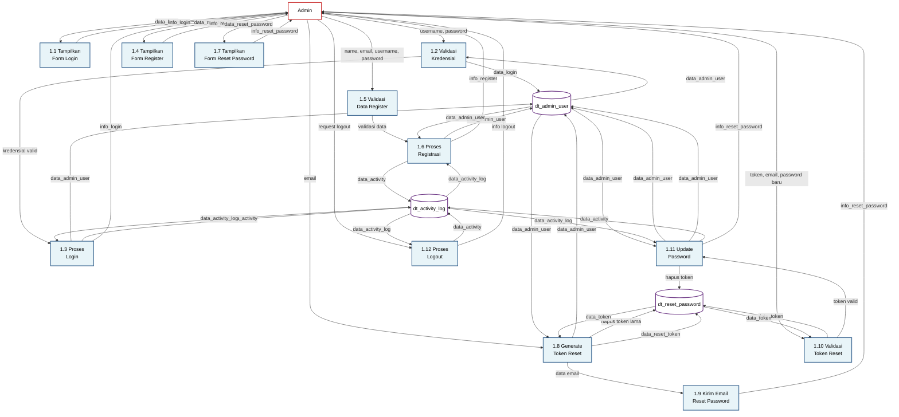
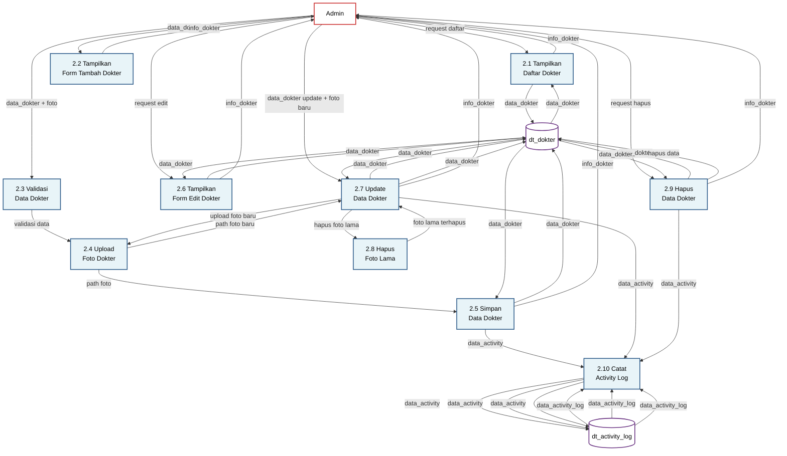
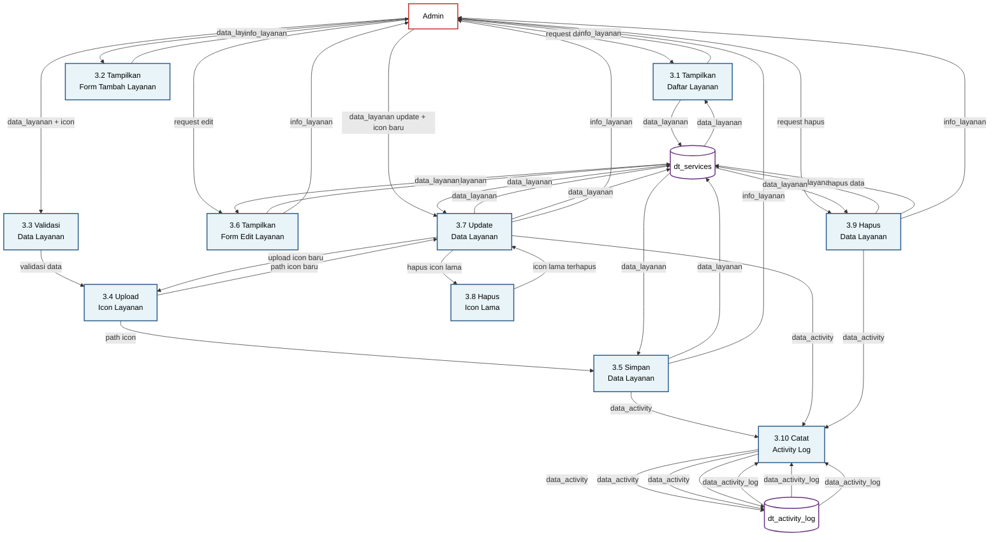
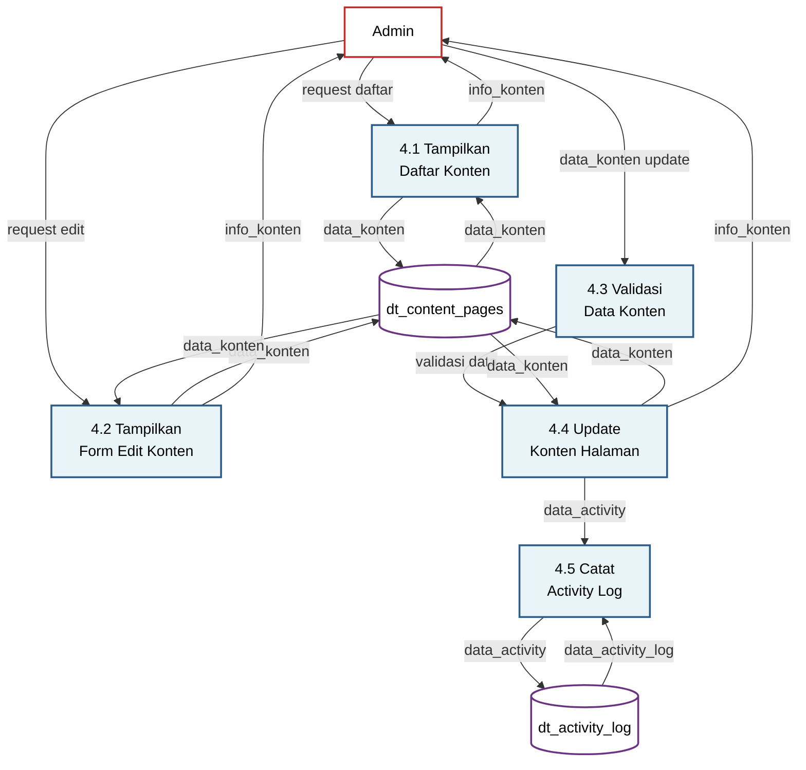
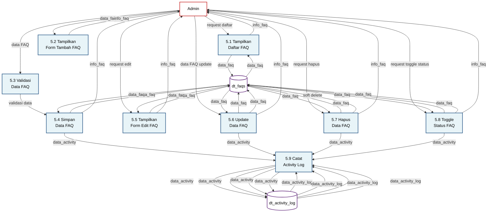
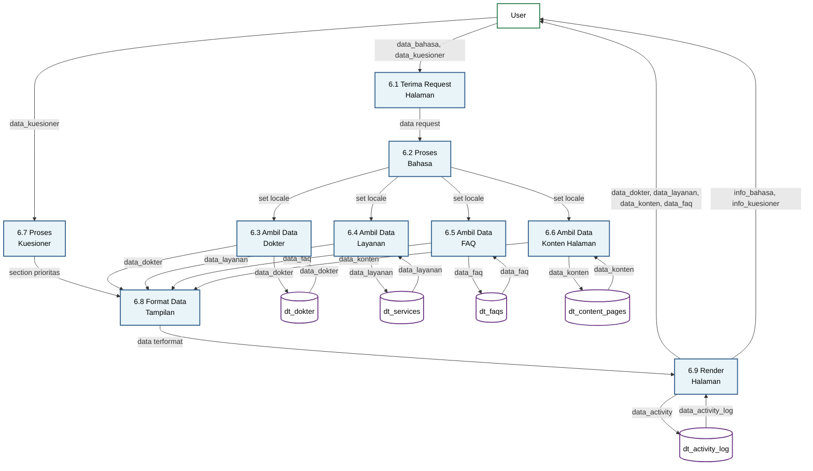

# DFD Level 1 - Legian Medical Clinic Website

## Overview
DFD Level 1 memecah setiap proses di DFD Level 0 menjadi sub-proses detail yang menunjukkan alur data internal sistem. Setiap proses utama dipecah menjadi proses-proses yang lebih spesifik sesuai dengan implementasi aktual sistem.

## Aturan DFD yang Diterapkan

1. **Penamaan Data Store**: Menggunakan format `dt_` sesuai dengan DFD Level 0 yang diberikan
2. **Alur Data**: Setiap alur data harus memiliki label yang jelas
3. **Tidak Ada Alur Langsung Antar Data Store**: Data store hanya berinteraksi dengan proses
4. **Konsistensi Nomor Proses**: Setiap sub-proses menggunakan format `x.y` dimana `x` adalah nomor proses utama
5. **Input/Output Jelas**: Setiap proses harus memiliki input dan output yang jelas

---

## 1. DFD Level 1 - Login/Register Admin (1.0)

**Keterangan Proses:**
- **1.1 Tampilkan Form Login**: Menampilkan form login kepada admin
- **1.2 Validasi Kredensial**: Memvalidasi username dan password dengan database
- **1.3 Proses Login**: Melakukan autentikasi, update last_login_at, dan mencatat activity log
- **1.4 Tampilkan Form Register**: Menampilkan form registrasi admin baru
- **1.5 Validasi Data Register**: Memvalidasi data registrasi (email, username harus unique)
- **1.6 Proses Registrasi**: Membuat akun admin baru dan mencatat activity log
- **1.7 Tampilkan Form Reset Password**: Menampilkan form untuk request reset password
- **1.8 Generate Token Reset**: Membuat token reset password dan menyimpan ke database
- **1.9 Kirim Email Reset Password**: Mengirim email reset password ke admin
- **1.10 Validasi Token Reset**: Memvalidasi token reset password (cek expiry dan validitas)
- **1.11 Update Password**: Mengupdate password admin dan menghapus token yang digunakan
- **1.12 Proses Logout**: Melakukan logout dan mencatat activity log

---

## 2. DFD Level 1 - Manajemen Dokter (2.0)

**Keterangan Proses:**
- **2.1 Tampilkan Daftar Dokter**: Menampilkan daftar semua dokter dengan pagination
- **2.2 Tampilkan Form Tambah Dokter**: Menampilkan form untuk menambah dokter baru
- **2.3 Validasi Data Dokter**: Memvalidasi data dokter (name_id, name_en, specialization_id, specialization_en, foto)
- **2.4 Upload Foto Dokter**: Mengupload foto dokter ke file storage
- **2.5 Simpan Data Dokter**: Menyimpan data dokter ke database dan mencatat activity log
- **2.6 Tampilkan Form Edit Dokter**: Menampilkan form edit dengan data dokter yang ada
- **2.7 Update Data Dokter**: Mengupdate data dokter (termasuk foto jika ada)
- **2.8 Hapus Foto Lama**: Menghapus foto lama saat update foto baru
- **2.9 Hapus Data Dokter**: Menghapus data dokter dan foto terkait
- **2.10 Catat Activity Log**: Mencatat semua aktivitas CRUD dokter ke activity log

---

## 3. DFD Level 1 - Manajemen Layanan (3.0)

**Keterangan Proses:**
- **3.1 Tampilkan Daftar Layanan**: Menampilkan daftar semua layanan dengan sorting berdasarkan sort_order
- **3.2 Tampilkan Form Tambah Layanan**: Menampilkan form untuk menambah layanan baru
- **3.3 Validasi Data Layanan**: Memvalidasi data layanan (name_id, name_en, description_id, description_en, price, icon)
- **3.4 Upload Icon Layanan**: Mengupload icon layanan ke file storage
- **3.5 Simpan Data Layanan**: Menyimpan data layanan ke database dan mencatat activity log
- **3.6 Tampilkan Form Edit Layanan**: Menampilkan form edit dengan data layanan yang ada
- **3.7 Update Data Layanan**: Mengupdate data layanan (termasuk icon jika ada)
- **3.8 Hapus Icon Lama**: Menghapus icon lama saat update icon baru
- **3.9 Hapus Data Layanan**: Menghapus data layanan dan icon terkait
- **3.10 Catat Activity Log**: Mencatat semua aktivitas CRUD layanan ke activity log

---

## 4. DFD Level 1 - Manajemen Konten (4.0)

**Keterangan Proses:**
- **4.1 Tampilkan Daftar Konten**: Menampilkan daftar semua konten halaman (about_us, contact, faq) dengan versi ID dan EN
- **4.2 Tampilkan Form Edit Konten**: Menampilkan form edit konten untuk bahasa ID dan EN
- **4.3 Validasi Data Konten**: Memvalidasi data konten (title, content, meta_data untuk setiap locale)
- **4.4 Update Konten Halaman**: Mengupdate konten halaman untuk setiap locale (ID dan EN)
- **4.5 Catat Activity Log**: Mencatat aktivitas update konten ke activity log

---

## 5. DFD Level 1 - Manajemen FAQ (5.0)

**Keterangan Proses:**
- **5.1 Tampilkan Daftar FAQ**: Menampilkan daftar semua FAQ termasuk yang soft deleted, dengan sorting berdasarkan sort_order
- **5.2 Tampilkan Form Tambah FAQ**: Menampilkan form untuk menambah FAQ baru
- **5.3 Validasi Data FAQ**: Memvalidasi data FAQ (question_id, question_en, answer_id, answer_en, category, sort_order)
- **5.4 Simpan Data FAQ**: Menyimpan data FAQ ke database dan mencatat activity log
- **5.5 Tampilkan Form Edit FAQ**: Menampilkan form edit dengan data FAQ yang ada
- **5.6 Update Data FAQ**: Mengupdate data FAQ dan mencatat activity log
- **5.7 Hapus Data FAQ**: Melakukan soft delete pada FAQ (mengset deleted_at)
- **5.8 Toggle Status FAQ**: Mengaktifkan/menonaktifkan FAQ dengan mengubah is_active
- **5.9 Catat Activity Log**: Mencatat semua aktivitas CRUD FAQ ke activity log

---

## 6. DFD Level 1 - Tampilan Website (6.0)

**Keterangan Proses:**
- **6.1 Terima Request Halaman**: Menerima request dari pengunjung untuk melihat halaman website
- **6.2 Proses Bahasa**: Memproses pemilihan bahasa (ID/EN) dari session atau request
- **6.3 Ambil Data Dokter**: Mengambil data dokter yang aktif dari database
- **6.4 Ambil Data Layanan**: Mengambil data layanan yang aktif dari database (sorted by sort_order)
- **6.5 Ambil Data FAQ**: Mengambil data FAQ yang aktif dari database (sorted by sort_order)
- **6.6 Ambil Data Konten Halaman**: Mengambil konten halaman berdasarkan locale (ID/EN)
- **6.7 Proses Kuesioner**: Memproses kuesioner dari pengunjung untuk menentukan section prioritas
- **6.8 Format Data Tampilan**: Memformat data untuk ditampilkan sesuai dengan locale dan prioritas section
- **6.9 Render Halaman**: Merender halaman website dengan data yang sudah diformat dan mencatat activity log

---

## Mapping Data Store

| Data Store | Nama Tabel | Deskripsi |
|------------|------------|-----------|
| dt_admin_user | admin_users | Menyimpan data admin user |
| dt_dokter | doctors | Menyimpan data dokter |
| dt_services | services | Menyimpan data layanan medis |
| dt_content_pages | content_pages | Menyimpan konten halaman website |
| dt_faqs | faqs | Menyimpan data FAQ |
| dt_activity_log | activity_logs | Menyimpan log aktivitas admin |
| dt_reset_password | admin_password_reset_tokens | Menyimpan token reset password |

---

## Alur Data Utama

### 1. Alur Login Admin
1. Admin mengirim `data_login` ke P1.1
2. P1.1 menampilkan form login
3. Admin mengirim `username, password` ke P1.2
4. P1.2 memvalidasi dengan dt_admin_user
5. Jika valid, P1.3 melakukan login dan update dt_admin_user, catat ke dt_activity_log
6. P1.3 mengirim `info_login` ke Admin

### 2. Alur Tambah Dokter
1. Admin mengirim `data_dokter` ke P2.2
2. P2.2 menampilkan form
3. Admin mengirim `data_dokter + foto` ke P2.3
4. P2.3 memvalidasi, P2.4 upload foto
5. P2.5 menyimpan data ke dt_dokter, catat ke dt_activity_log
6. P2.5 mengirim `info_dokter` ke Admin

### 3. Alur Tampilan Website
1. User mengirim `data_bahasa, data_kuesioner` ke P6.1
2. P6.2 memproses bahasa dan set locale
3. P6.3, P6.4, P6.5, P6.6 mengambil data dari dt_dokter, dt_services, dt_faqs, dt_content_pages
4. P6.7 memproses kuesioner jika ada
5. P6.8 memformat data sesuai locale dan prioritas
6. P6.9 merender halaman dan mengirim ke User, catat ke dt_activity_log

---

**Dibuat**: 2024  
**Versi**: 1.0  
**Sistem**: Legian Medical Clinic Website CMS

