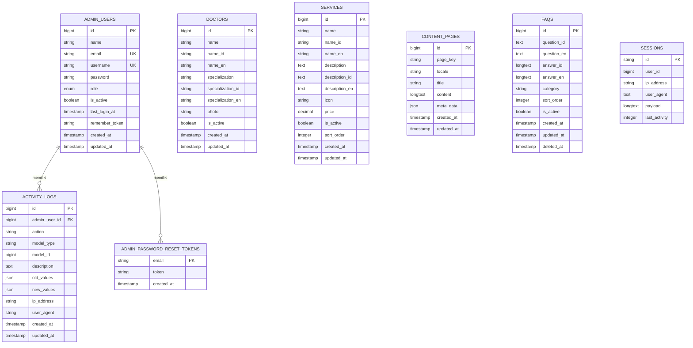

# ERD (Entity-Relationship Diagram) - Legian Medical Clinic Website

## Overview
ERD ini menggambarkan struktur database dan relasi antar entitas pada sistem website Legian Medical Clinic. Diagram ini menunjukkan semua tabel, atribut, dan hubungan yang ada dalam database.

---

## Entity-Relationship Diagram



---

## Detail Entitas dan Atribut

### 1. ADMIN_USERS
**Deskripsi**: Menyimpan data admin yang mengelola sistem CMS

| Atribut | Tipe | Keterangan |
|---------|------|------------|
| id | bigint | Primary Key, Auto Increment |
| name | string | Nama lengkap admin |
| email | string | Email admin (Unique) |
| username | string | Username untuk login (Unique) |
| password | string | Password ter-hash |
| role | enum | Role admin: 'super_admin' atau 'admin' |
| is_active | boolean | Status aktif/tidak aktif |
| last_login_at | timestamp | Waktu login terakhir |
| remember_token | string | Token untuk remember me |
| created_at | timestamp | Waktu pembuatan |
| updated_at | timestamp | Waktu update terakhir |

**Relasi**:
- Satu admin dapat memiliki banyak activity logs (1:M)
- Satu admin dapat memiliki banyak password reset tokens (1:M)

---

### 2. DOCTORS
**Deskripsi**: Menyimpan data dokter yang bekerja di klinik

| Atribut | Tipe | Keterangan |
|---------|------|------------|
| id | bigint | Primary Key, Auto Increment |
| name | string | Nama dokter (backward compatibility) |
| name_id | string | Nama dokter dalam bahasa Indonesia |
| name_en | string | Nama dokter dalam bahasa Inggris |
| specialization | string | Spesialisasi (backward compatibility) |
| specialization_id | string | Spesialisasi dalam bahasa Indonesia |
| specialization_en | string | Spesialisasi dalam bahasa Inggris |
| photo | string | Path foto dokter |
| is_active | boolean | Status aktif/tidak aktif |
| created_at | timestamp | Waktu pembuatan |
| updated_at | timestamp | Waktu update terakhir |

**Relasi**: Tidak ada relasi foreign key ke entitas lain

---

### 3. SERVICES
**Deskripsi**: Menyimpan data layanan medis yang ditawarkan klinik

| Atribut | Tipe | Keterangan |
|---------|------|------------|
| id | bigint | Primary Key, Auto Increment |
| name | string | Nama layanan (backward compatibility) |
| name_id | string | Nama layanan dalam bahasa Indonesia |
| name_en | string | Nama layanan dalam bahasa Inggris |
| description | text | Deskripsi layanan (backward compatibility) |
| description_id | text | Deskripsi dalam bahasa Indonesia |
| description_en | text | Deskripsi dalam bahasa Inggris |
| icon | string | Path icon layanan |
| price | decimal(10,2) | Harga layanan (nullable) |
| is_active | boolean | Status aktif/tidak aktif |
| sort_order | integer | Urutan tampil (default: 0) |
| created_at | timestamp | Waktu pembuatan |
| updated_at | timestamp | Waktu update terakhir |

**Relasi**: Tidak ada relasi foreign key ke entitas lain

---

### 4. CONTENT_PAGES
**Deskripsi**: Menyimpan konten halaman website (About Us, Contact, FAQ, dll)

| Atribut | Tipe | Keterangan |
|---------|------|------------|
| id | bigint | Primary Key, Auto Increment |
| page_key | string | Key halaman (about_us, contact, faq, dll) |
| locale | string(2) | Bahasa: 'id' atau 'en' |
| title | string | Judul halaman |
| content | longtext | Isi konten halaman |
| meta_data | json | Data tambahan (alamat, email, dll) |
| created_at | timestamp | Waktu pembuatan |
| updated_at | timestamp | Waktu update terakhir |

**Constraint**: Unique constraint pada kombinasi (page_key, locale)

**Relasi**: Tidak ada relasi foreign key ke entitas lain

---

### 5. FAQS
**Deskripsi**: Menyimpan data Frequently Asked Questions (FAQ)

| Atribut | Tipe | Keterangan |
|---------|------|------------|
| id | bigint | Primary Key, Auto Increment |
| question_id | text | Pertanyaan dalam bahasa Indonesia |
| question_en | text | Pertanyaan dalam bahasa Inggris |
| answer_id | longtext | Jawaban dalam bahasa Indonesia |
| answer_en | longtext | Jawaban dalam bahasa Inggris |
| category | string | Kategori FAQ (default: 'general') |
| sort_order | integer | Urutan tampil (default: 0) |
| is_active | boolean | Status aktif/tidak aktif |
| created_at | timestamp | Waktu pembuatan |
| updated_at | timestamp | Waktu update terakhir |
| deleted_at | timestamp | Waktu soft delete (nullable) |

**Relasi**: Tidak ada relasi foreign key ke entitas lain

**Catatan**: Menggunakan soft delete (deleted_at)

---

### 6. ACTIVITY_LOGS
**Deskripsi**: Menyimpan log aktivitas admin dalam sistem

| Atribut | Tipe | Keterangan |
|---------|------|------------|
| id | bigint | Primary Key, Auto Increment |
| admin_user_id | bigint | Foreign Key ke admin_users.id |
| action | string | Aksi yang dilakukan (create, update, delete, login, logout) |
| model_type | string | Tipe model yang diubah (Doctor, Service, ContentPage, dll) |
| model_id | bigint | ID model yang diubah |
| description | text | Deskripsi aktivitas |
| old_values | json | Nilai lama sebelum perubahan |
| new_values | json | Nilai baru setelah perubahan |
| ip_address | string | IP address admin |
| user_agent | string | User agent browser |
| created_at | timestamp | Waktu pembuatan |
| updated_at | timestamp | Waktu update terakhir |

**Relasi**:
- Banyak activity logs dimiliki oleh satu admin (M:1)
- Foreign Key: admin_user_id → admin_users.id (onDelete: cascade)

---

### 7. ADMIN_PASSWORD_RESET_TOKENS
**Deskripsi**: Menyimpan token reset password untuk admin

| Atribut | Tipe | Keterangan |
|---------|------|------------|
| email | string | Primary Key, Email admin |
| token | string | Token reset password |
| created_at | timestamp | Waktu pembuatan token |

**Relasi**:
- Banyak tokens dimiliki oleh satu admin (M:1)
- Relasi berdasarkan email (tidak ada foreign key formal)

---

### 8. SESSIONS
**Deskripsi**: Menyimpan data session untuk aplikasi Laravel

| Atribut | Tipe | Keterangan |
|---------|------|------------|
| id | string | Primary Key, Session ID |
| user_id | bigint | User ID (nullable, tidak ada foreign key - untuk backward compatibility) |
| ip_address | string(45) | IP address pengunjung |
| user_agent | text | User agent browser |
| payload | longtext | Data session terenkripsi |
| last_activity | integer | Timestamp aktivitas terakhir |

**Relasi**: Tidak ada relasi foreign key formal. Kolom `user_id` tetap ada untuk backward compatibility dengan Laravel, namun tidak digunakan karena tabel `users` sudah dihapus.

---

## Relasi Antar Entitas

### 1. ADMIN_USERS → ACTIVITY_LOGS
- **Tipe**: One-to-Many (1:M)
- **Keterangan**: Satu admin dapat melakukan banyak aktivitas yang tercatat dalam activity logs
- **Foreign Key**: `activity_logs.admin_user_id` → `admin_users.id`
- **On Delete**: Cascade (jika admin dihapus, semua activity logs-nya juga dihapus)

### 2. ADMIN_USERS → ADMIN_PASSWORD_RESET_TOKENS
- **Tipe**: One-to-Many (1:M)
- **Keterangan**: Satu admin dapat memiliki banyak token reset password (untuk keamanan, token lama tetap tersimpan sampai expired)
- **Relasi**: Berdasarkan email (tidak ada foreign key formal)

---

## Karakteristik Database

### 1. Multilanguage Support
- **DOCTORS**: Mendukung bahasa Indonesia (name_id, specialization_id) dan Inggris (name_en, specialization_en)
- **SERVICES**: Mendukung bahasa Indonesia (name_id, description_id) dan Inggris (name_en, description_en)
- **CONTENT_PAGES**: Mendukung multilanguage melalui kolom `locale` dengan unique constraint pada (page_key, locale)
- **FAQS**: Mendukung bahasa Indonesia (question_id, answer_id) dan Inggris (question_en, answer_en)

### 2. Soft Delete
- **FAQS**: Menggunakan soft delete dengan kolom `deleted_at`

### 3. Activity Logging
- Semua aktivitas admin dicatat dalam **ACTIVITY_LOGS** dengan informasi lengkap termasuk old_values dan new_values

### 4. Status Management
- **DOCTORS**, **SERVICES**, **FAQS**, dan **ADMIN_USERS** memiliki kolom `is_active` untuk mengontrol visibilitas/akses

### 5. Sorting
- **SERVICES** dan **FAQS** memiliki kolom `sort_order` untuk mengatur urutan tampil

---

## Index dan Constraints

### Primary Keys
- Semua tabel memiliki `id` sebagai Primary Key (bigint, auto increment)
- **ADMIN_PASSWORD_RESET_TOKENS** menggunakan `email` sebagai Primary Key
- **SESSIONS** menggunakan `id` (string) sebagai Primary Key

### Unique Constraints
- `admin_users.email` - Unique
- `admin_users.username` - Unique
- `content_pages(page_key, locale)` - Unique composite

### Foreign Keys
- `activity_logs.admin_user_id` → `admin_users.id` (onDelete: cascade)

### Indexes
- `sessions.user_id` - Indexed
- `sessions.last_activity` - Indexed

---

## Diagram Relasi Sederhana

```
ADMIN_USERS (1) ──────< (M) ACTIVITY_LOGS
ADMIN_USERS (1) ──────< (M) ADMIN_PASSWORD_RESET_TOKENS

SESSIONS (independent - user_id nullable, tidak ada foreign key)

DOCTORS (independent)
SERVICES (independent)
CONTENT_PAGES (independent)
FAQS (independent)
```

---

## Catatan Penting

1. **Backward Compatibility**: Tabel `doctors` dan `services` masih memiliki kolom `name`, `specialization`, dan `description` untuk backward compatibility, namun sebaiknya menggunakan kolom multilingual (`*_id` dan `*_en`)

2. **Activity Logging**: Sistem mencatat semua aktivitas admin termasuk perubahan data (old_values dan new_values) untuk audit trail

3. **Multilanguage**: Sistem mendukung dua bahasa (Indonesia dan Inggris) untuk konten yang ditampilkan ke pengunjung website

4. **Soft Delete**: FAQ menggunakan soft delete, sehingga data tidak benar-benar dihapus dari database

5. **Session Management**: Session digunakan untuk menyimpan data sementara seperti preferensi bahasa, data kuesioner, dan flash messages. Kolom `user_id` tetap ada untuk backward compatibility namun tidak digunakan karena tabel `users` sudah dihapus.

---

**Dibuat**: 2024  
**Versi**: 1.0  
**Sistem**: Legian Medical Clinic Website CMS  
**Database**: MySQL

