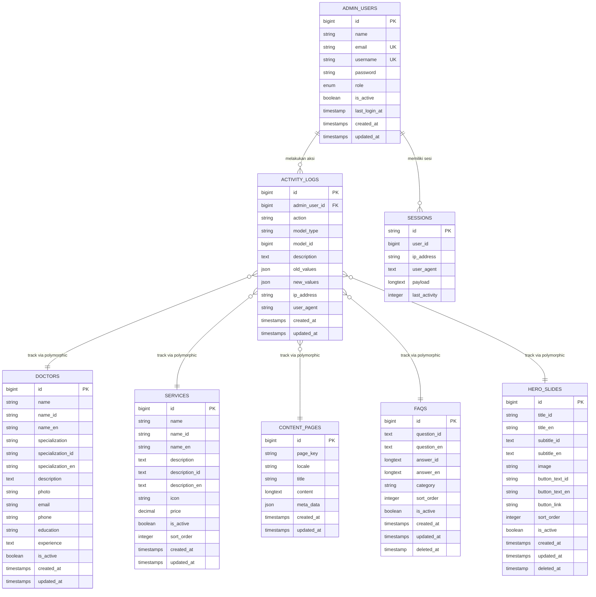

# Entity Relationship Diagram (ERD)
## Sistem Website Legian Medical Clinic

### Overview
Diagram ini menunjukkan struktur database dan relasi antar entitas dalam sistem website Legian Medical Clinic.

---

## ERD Diagram (Mermaid)

---

## Deskripsi Entitas

### 1. ADMIN_USERS
Tabel untuk menyimpan data admin yang memiliki akses ke admin panel.

**Atribut Utama:**
- `id`: Primary key
- `email`: Email unik admin
- `username`: Username unik admin
- `password`: Password terenkripsi
- `role`: Role admin (super_admin, admin)
- `is_active`: Status aktif/tidak aktif
- `last_login_at`: Waktu login terakhir

**Relasi:**
- One-to-Many dengan ACTIVITY_LOGS
- One-to-Many dengan SESSIONS (optional)

---

### 2. DOCTORS
Tabel untuk menyimpan data dokter yang bekerja di klinik.

**Atribut Utama:**
- `id`: Primary key
- `name`, `name_id`, `name_en`: Nama dokter (multilingual)
- `specialization`, `specialization_id`, `specialization_en`: Spesialisasi (multilingual)
- `description`: Deskripsi dokter
- `photo`: Path foto dokter
- `email`, `phone`: Kontak dokter
- `education`: Riwayat pendidikan
- `experience`: Pengalaman
- `is_active`: Status aktif/tidak aktif

**Relasi:**
- Tidak ada foreign key, tetapi dapat di-track melalui ACTIVITY_LOGS (polymorphic)

---

### 3. SERVICES
Tabel untuk menyimpan data layanan yang ditawarkan klinik.

**Atribut Utama:**
- `id`: Primary key
- `name`, `name_id`, `name_en`: Nama layanan (multilingual)
- `description`, `description_id`, `description_en`: Deskripsi layanan (multilingual)
- `icon`: Path icon layanan
- `price`: Harga layanan
- `is_active`: Status aktif/tidak aktif
- `sort_order`: Urutan tampil

**Relasi:**
- Tidak ada foreign key, tetapi dapat di-track melalui ACTIVITY_LOGS (polymorphic)

---

### 4. CONTENT_PAGES
Tabel untuk menyimpan konten halaman website (multilingual).

**Atribut Utama:**
- `id`: Primary key
- `page_key`: Key unik halaman (about_us, contact, dll)
- `locale`: Bahasa (id, en)
- `title`: Judul halaman
- `content`: Isi konten halaman
- `meta_data`: Data tambahan dalam format JSON

**Unique Constraint:**
- `(page_key, locale)`: Satu kombinasi page_key dan locale hanya boleh ada satu

**Relasi:**
- Tidak ada foreign key, tetapi dapat di-track melalui ACTIVITY_LOGS (polymorphic)

---

### 5. FAQS
Tabel untuk menyimpan Frequently Asked Questions (FAQ).

**Atribut Utama:**
- `id`: Primary key
- `question_id`, `question_en`: Pertanyaan dalam bahasa Indonesia dan Inggris
- `answer_id`, `answer_en`: Jawaban dalam bahasa Indonesia dan Inggris
- `category`: Kategori FAQ
- `sort_order`: Urutan tampil
- `is_active`: Status aktif/tidak aktif
- `deleted_at`: Soft delete timestamp

**Relasi:**
- Tidak ada foreign key, tetapi dapat di-track melalui ACTIVITY_LOGS (polymorphic)

---

### 6. HERO_SLIDES
Tabel untuk menyimpan slide hero di homepage.

**Atribut Utama:**
- `id`: Primary key
- `title_id`, `title_en`: Judul slide (multilingual)
- `subtitle_id`, `subtitle_en`: Subjudul slide (multilingual)
- `image`: Path gambar slide
- `button_text_id`, `button_text_en`: Teks tombol (multilingual)
- `button_link`: Link tombol
- `sort_order`: Urutan tampil
- `is_active`: Status aktif/tidak aktif
- `deleted_at`: Soft delete timestamp

**Relasi:**
- Tidak ada foreign key, tetapi dapat di-track melalui ACTIVITY_LOGS (polymorphic)

---

### 7. ACTIVITY_LOGS
Tabel untuk menyimpan log aktivitas admin.

**Atribut Utama:**
- `id`: Primary key
- `admin_user_id`: Foreign key ke ADMIN_USERS
- `action`: Jenis aksi (create, update, delete, login, logout)
- `model_type`: Tipe model yang di-akses (Doctor, Service, ContentPage, dll)
- `model_id`: ID model yang di-akses
- `description`: Deskripsi aktivitas
- `old_values`: Nilai lama (JSON)
- `new_values`: Nilai baru (JSON)
- `ip_address`: IP address admin
- `user_agent`: User agent browser

**Relasi:**
- Many-to-One dengan ADMIN_USERS

**Polymorphic Relationship:**
- Dapat merujuk ke berbagai model melalui `model_type` dan `model_id`

---

### 8. SESSIONS
Tabel untuk menyimpan session Laravel.

**Atribut Utama:**
- `id`: Primary key (session ID)
- `user_id`: ID user (nullable, untuk admin_users)
- `ip_address`: IP address
- `user_agent`: User agent browser
- `payload`: Data session
- `last_activity`: Timestamp aktivitas terakhir

**Relasi:**
- Many-to-One dengan ADMIN_USERS (optional, melalui user_id)

---

## Tipe Relasi

1. **One-to-Many (1:N)**
   - ADMIN_USERS → ACTIVITY_LOGS: Satu admin dapat melakukan banyak aktivitas
   - ADMIN_USERS → SESSIONS: Satu admin dapat memiliki banyak session

2. **Polymorphic Relationship**
   - ACTIVITY_LOGS dapat merujuk ke berbagai entitas (DOCTORS, SERVICES, CONTENT_PAGES, FAQS, HERO_SLIDES) melalui `model_type` dan `model_id`

---

## Catatan Penting

1. **Multilingual Support**: Beberapa tabel (DOCTORS, SERVICES, FAQS, HERO_SLIDES, CONTENT_PAGES) mendukung multi-bahasa (Indonesia & Inggris).

2. **Soft Delete**: FAQS dan HERO_SLIDES menggunakan soft delete (tidak menghapus record secara permanen).

3. **Activity Logging**: Semua perubahan data dapat di-track melalui ACTIVITY_LOGS dengan polymorphic relationship.

4. **Unique Constraints**: 
   - ADMIN_USERS: email dan username harus unik
   - CONTENT_PAGES: kombinasi page_key dan locale harus unik

5. **Index**: 
   - ACTIVITY_LOGS memiliki index pada admin_user_id untuk performa query
   - SESSIONS memiliki index pada user_id dan last_activity

---

## Teknologi Database

- **DBMS**: MySQL
- **Framework**: Laravel 11
- **ORM**: Eloquent ORM

---

© 2024 Legian Medical Clinic

