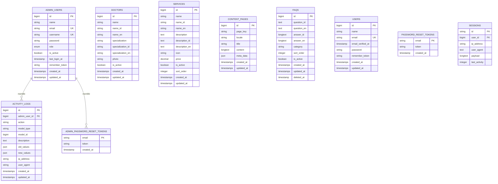

# Entity Relationship Diagram (ERD) - Legian Medical Clinic Website

## Overview
ERD ini menggambarkan struktur database dan relasi antar entitas pada website Legian Medical Clinic.

## Entity Relationship Diagram

## Deskripsi Entitas

### 1. ADMIN_USERS
Tabel untuk menyimpan data admin yang mengelola website.
- **Primary Key**: `id`
- **Unique Keys**: `email`, `username`
- **Relasi**: 
  - One-to-Many dengan `ACTIVITY_LOGS`
  - One-to-Many dengan `ADMIN_PASSWORD_RESET_TOKENS`

### 2. DOCTORS
Tabel untuk menyimpan informasi dokter.
- **Primary Key**: `id`
- **Fitur Multilanguage**: Mendukung bahasa Indonesia (`name_id`, `specialization_id`) dan Inggris (`name_en`, `specialization_en`)
- **Field Khusus**: 
  - `photo`: Path foto dokter
  - `is_active`: Status aktif/non-aktif

### 3. SERVICES
Tabel untuk menyimpan informasi layanan medis.
- **Primary Key**: `id`
- **Fitur Multilanguage**: Mendukung bahasa Indonesia (`name_id`, `description_id`) dan Inggris (`name_en`, `description_en`)
- **Field Khusus**: 
  - `icon`: Path icon layanan
  - `price`: Harga layanan
  - `sort_order`: Urutan tampilan

### 4. CONTENT_PAGES
Tabel untuk menyimpan konten halaman (About Us, Contact, dll).
- **Primary Key**: `id`
- **Unique Constraint**: `(page_key, locale)` - Setiap halaman memiliki versi per bahasa
- **Field Khusus**: 
  - `page_key`: Identifier halaman (about_us, contact, dll)
  - `locale`: Bahasa (id, en)
  - `meta_data`: Data tambahan dalam format JSON

### 5. FAQS
Tabel untuk menyimpan Frequently Asked Questions.
- **Primary Key**: `id`
- **Fitur Multilanguage**: Mendukung bahasa Indonesia (`question_id`, `answer_id`) dan Inggris (`question_en`, `answer_en`)
- **Soft Deletes**: Menggunakan `deleted_at` untuk soft delete
- **Field Khusus**: 
  - `category`: Kategori FAQ
  - `sort_order`: Urutan tampilan

### 6. ACTIVITY_LOGS
Tabel untuk menyimpan log aktivitas admin.
- **Primary Key**: `id`
- **Foreign Key**: `admin_user_id` → `ADMIN_USERS.id`
- **Field Khusus**: 
  - `action`: Jenis aksi (create, update, delete, login, logout)
  - `model_type`: Tipe model yang diubah (Doctor, Service, ContentPage, dll)
  - `model_id`: ID model yang diubah
  - `old_values`, `new_values`: JSON untuk menyimpan nilai sebelum dan sesudah perubahan

### 7. ADMIN_PASSWORD_RESET_TOKENS
Tabel untuk menyimpan token reset password admin.
- **Primary Key**: `email`
- **Relasi**: Many-to-One dengan `ADMIN_USERS` (melalui email)

### 8. USERS
Tabel default Laravel untuk user (mungkin tidak digunakan dalam aplikasi ini).
- **Primary Key**: `id`
- **Unique Key**: `email`

### 9. PASSWORD_RESET_TOKENS
Tabel default Laravel untuk token reset password user.
- **Primary Key**: `email`

### 10. SESSIONS
Tabel default Laravel untuk menyimpan session user.
- **Primary Key**: `id`
- **Foreign Key**: `user_id` → `USERS.id`

## Relasi Antar Entitas

1. **ADMIN_USERS → ACTIVITY_LOGS** (One-to-Many)
   - Satu admin dapat memiliki banyak activity log
   - Foreign key: `activity_logs.admin_user_id` → `admin_users.id`
   - Cascade delete: Jika admin dihapus, activity log juga dihapus

2. **ADMIN_USERS → ADMIN_PASSWORD_RESET_TOKENS** (One-to-Many)
   - Satu admin dapat memiliki banyak token reset password
   - Relasi melalui `email`

## Catatan Penting

1. **Multilanguage Support**: 
   - Tabel `DOCTORS`, `SERVICES`, dan `FAQS` mendukung multilanguage (Indonesia & Inggris)
   - Tabel `CONTENT_PAGES` menggunakan kombinasi `page_key` dan `locale` untuk multilanguage

2. **Soft Deletes**: 
   - Tabel `FAQS` menggunakan soft deletes (tidak benar-benar dihapus dari database)

3. **Activity Logging**: 
   - Semua aktivitas admin dicatat di `ACTIVITY_LOGS` dengan informasi detail perubahan

4. **Status Aktif**: 
   - Tabel `DOCTORS`, `SERVICES`, `FAQS`, dan `ADMIN_USERS` memiliki field `is_active` untuk mengontrol visibilitas/status

5. **Sorting**: 
   - Tabel `SERVICES` dan `FAQS` memiliki field `sort_order` untuk mengatur urutan tampilan

