# Entity Relationship Diagram (ERD) - Mermaid Chart
## Sistem Website Legian Medical Clinic

### Overview
Diagram ini menunjukkan struktur database dan relasi antar entitas dalam sistem website Legian Medical Clinic menggunakan format Mermaid ER Diagram.

---

## ERD Diagram (Mermaid)

```mermaid
erDiagram
    ADMIN_USERS {
        bigint id PK "Primary Key"
        string name "Nama Admin"
        string email UK "Email Unik"
        string username UK "Username Unik"
        string password "Password Terenkripsi"
        enum role "super_admin, admin"
        boolean is_active "Status Aktif"
        timestamp last_login_at "Waktu Login Terakhir"
        timestamp created_at "Waktu Dibuat"
        timestamp updated_at "Waktu Diupdate"
    }
    
    DOCTORS {
        bigint id PK "Primary Key"
        string name "Nama Dokter"
        string name_id "Nama (Indonesia)"
        string name_en "Nama (Inggris)"
        string specialization "Spesialisasi"
        string specialization_id "Spesialisasi (Indonesia)"
        string specialization_en "Spesialisasi (Inggris)"
        text description "Deskripsi"
        string photo "Path Foto"
        string email "Email Dokter"
        string phone "Nomor Telepon"
        string education "Riwayat Pendidikan"
        text experience "Pengalaman"
        boolean is_active "Status Aktif"
        timestamp created_at "Waktu Dibuat"
        timestamp updated_at "Waktu Diupdate"
    }
    
    SERVICES {
        bigint id PK "Primary Key"
        string name "Nama Layanan"
        string name_id "Nama (Indonesia)"
        string name_en "Nama (Inggris)"
        text description "Deskripsi"
        text description_id "Deskripsi (Indonesia)"
        text description_en "Deskripsi (Inggris)"
        string icon "Path Icon"
        decimal price "Harga"
        boolean is_active "Status Aktif"
        integer sort_order "Urutan Tampil"
        timestamp created_at "Waktu Dibuat"
        timestamp updated_at "Waktu Diupdate"
    }
    
    CONTENT_PAGES {
        bigint id PK "Primary Key"
        string page_key "Key Halaman (about_us, contact, dll)"
        string locale "Bahasa (id, en)"
        string title "Judul Halaman"
        longtext content "Isi Konten"
        json meta_data "Data Tambahan (JSON)"
        timestamp created_at "Waktu Dibuat"
        timestamp updated_at "Waktu Diupdate"
    }
    
    FAQS {
        bigint id PK "Primary Key"
        text question_id "Pertanyaan (Indonesia)"
        text question_en "Pertanyaan (Inggris)"
        longtext answer_id "Jawaban (Indonesia)"
        longtext answer_en "Jawaban (Inggris)"
        string category "Kategori FAQ"
        integer sort_order "Urutan Tampil"
        boolean is_active "Status Aktif"
        timestamp created_at "Waktu Dibuat"
        timestamp updated_at "Waktu Diupdate"
        timestamp deleted_at "Soft Delete"
    }
    
    HERO_SLIDES {
        bigint id PK "Primary Key"
        string title_id "Judul (Indonesia)"
        string title_en "Judul (Inggris)"
        text subtitle_id "Subjudul (Indonesia)"
        text subtitle_en "Subjudul (Inggris)"
        string image "Path Gambar"
        string button_text_id "Teks Tombol (Indonesia)"
        string button_text_en "Teks Tombol (Inggris)"
        string button_link "Link Tombol"
        integer sort_order "Urutan Tampil"
        boolean is_active "Status Aktif"
        timestamp created_at "Waktu Dibuat"
        timestamp updated_at "Waktu Diupdate"
        timestamp deleted_at "Soft Delete"
    }
    
    ACTIVITY_LOGS {
        bigint id PK "Primary Key"
        bigint admin_user_id FK "Foreign Key ke ADMIN_USERS"
        string action "Jenis Aksi (create, update, delete, login, logout)"
        text description "Deskripsi Aktivitas"
        json old_values "Nilai Lama (JSON)"
        json new_values "Nilai Baru (JSON)"
        string ip_address "IP Address"
        string user_agent "User Agent Browser"
        timestamp created_at "Waktu Dibuat"
        timestamp updated_at "Waktu Diupdate"
    }
    
    SESSIONS {
        string id PK "Primary Key (Session ID)"
        bigint user_id "ID User (nullable, untuk admin_users)"
        string ip_address "IP Address"
        text user_agent "User Agent Browser"
        longtext payload "Data Session"
        integer last_activity "Timestamp Aktivitas Terakhir"
    }

    %% Relationships
    ADMIN_USERS ||--o{ ACTIVITY_LOGS : "melakukan aksi"
    ADMIN_USERS ||--o{ SESSIONS : "memiliki sesi"
```

---

## Cara Menggunakan

### 1. Mermaid Live Editor
1. Buka https://mermaid.live/
2. Copy kode Mermaid di atas
3. Paste ke editor
4. Diagram akan otomatis dirender

### 2. VS Code
1. Install extension "Markdown Preview Mermaid Support"
2. Buka file ini di VS Code
3. Preview diagram dengan menekan `Ctrl+Shift+V` (Windows) atau `Cmd+Shift+V` (Mac)

### 3. GitHub/GitLab
- File ini akan otomatis dirender di GitHub/GitLab jika di-commit

### 4. Mermaid Chart (Aplikasi Online)
1. Buka https://www.mermaidchart.com/
2. Buat diagram baru
3. Copy kode Mermaid di atas
4. Paste ke editor

---

## Legenda Relasi

- `||--o{` : One-to-Many (1:N) - Satu entitas memiliki banyak entitas terkait
- `||--o|` : One-to-One (1:1) - Satu entitas memiliki satu entitas terkait

---

## Deskripsi Relasi

### 1. ADMIN_USERS → ACTIVITY_LOGS (1:N)
- **Relasi**: "melakukan aksi"
- **Deskripsi**: Satu admin dapat melakukan banyak aktivitas
- **Foreign Key**: `admin_user_id` di tabel `activity_logs`

### 2. ADMIN_USERS → SESSIONS (1:N)
- **Relasi**: "memiliki sesi"
- **Deskripsi**: Satu admin dapat memiliki banyak session
- **Foreign Key**: `user_id` di tabel `sessions` (nullable)

---

## Catatan Penting

1. **Multilingual Support**: 
   - DOCTORS, SERVICES, FAQS, HERO_SLIDES, dan CONTENT_PAGES mendukung multi-bahasa (Indonesia & Inggris)

2. **Soft Delete**: 
   - FAQS dan HERO_SLIDES menggunakan soft delete (tidak menghapus record secara permanen)

3. **Activity Logging**: 
   - Aktivitas admin dicatat dalam ACTIVITY_LOGS yang terhubung langsung dengan ADMIN_USERS

4. **Unique Constraints**: 
   - ADMIN_USERS: `email` dan `username` harus unik
   - CONTENT_PAGES: kombinasi `page_key` dan `locale` harus unik

5. **Index**: 
   - ACTIVITY_LOGS memiliki index pada `admin_user_id` untuk performa query
   - SESSIONS memiliki index pada `user_id` dan `last_activity`

---

## Teknologi Database

- **DBMS**: MySQL
- **Framework**: Laravel 11
- **ORM**: Eloquent ORM

---

© 2024 Legian Medical Clinic

